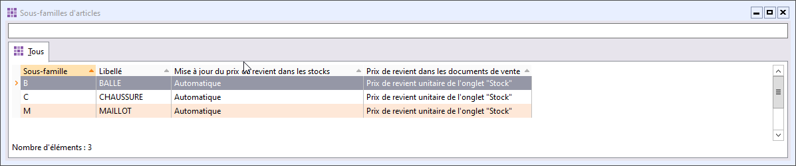

# Liste des sous-familles d'articles

La liste des sous-familles est accessible à partir de la commande Sous-famille 
 d’articles du menu ARTICLES et permet de gérer (création, modification, 
 suppression, impression) les fiches sous-familles à partir de la barre 
 d'outils, du menu contextuel ou des raccourcis claviers.

 

 

Toutes les listes ont un fonctionnement commun.

 

Par le menu contextuel, vous avez la possibilité 
 d'accéder à [la 
 modification des grilles de tarifs](../GrillesTarifsPromotions/1/OutilModificationGrillesTarifsMasse.md) qui affiche 
 les grilles de tarifs pour lesquelles l’article sélectionné est affecté.

