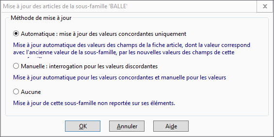

# Méthode de mise à jour des articles de la sous-famille

 

Lors d’une modification de la fiche d’une sous-famille, le logiciel 
 propose 3 méthodes de mise à jour des articles/tiers appartenant à cette 
 famille : 

* Automatique 
 : le logiciel met automatiquement à jour les champs de la fiche 
 du tiers/de l’article qui correspondant à la fiche famille et ne modifie 
 pas les valeurs non concordantes,
* Manuelle 
 : En mise à jour manuelle, le logiciel propose pour chaque tiers/chaque 
 article, les champs non concordants en affichant l’ancienne valeur 
 et la nouvelle. Tous les champs du tiers/de l’article sont par défaut 
 cochés et l’action portera sur ceux-ci.

Les opérations possibles sont les suivantes 
 :

+ Bouton Mettre 
 à jour : lance la mise à jour des champs cochés pour le tiers/l’article 
 et affiche les champs non concordants du tiers/de l’article suivant,
+ Bouton Ignorer 
 : ne modifie pas les champs du tiers/article et passe au tiers/à 
 l’article suivant,
+ Bouton Automatique 
 : met à jour tous les champs de tous les autres tiers/articles,
+ Bouton Ignorer 
 Tous : ne modifie aucun des champs du tiers/de l’article et des 
 suivants.

* Aucune mise à jour : la 
 modification de la famille sera prise en compte uniquement à la création 
 d’un nouveau tiers/d’un nouvel article.

