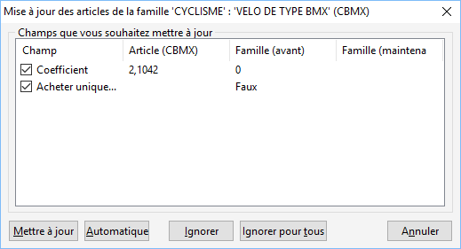

# Mise à jour manuelle des champs des articles de la sous-famille

En mise à jour manuelle, le logiciel propose pour chaque article, les 
 champs non concordants en affichant l’ancienne valeur et la nouvelle.

 

 

Tous les champs de l’article sont par défaut cochés et l’action portera 
 sur ceux-ci.

 

Les opérations possibles sont les suivantes :

* Bouton 
 Mettre à jour : lance la mise à jour des champs cochés pour 
 le tiers/l’article et affiche les champs non concordants du tiers/de 
 l’article suivant,
* Bouton Ignorer 
 : ne modifie pas les champs du tiers/article et passe au tiers/à l’article 
 suivant,
* Bouton Automatique 
 : met à jour tous les champs de tous les autres tiers/articles,
* Bouton Ignorer 
 Tous : ne modifie aucun des champs du tiers/de l’article et 
 des suivants.

