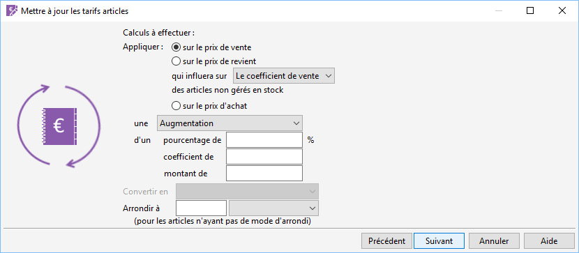

# Calculs à effectuer

La mise à jour des tarifs consiste à réaliser une augmentation ou une 
 diminution des tarifs suivant un pourcentage, 
 un coefficient ou un montant 
 déterminé.

 

## Modification du prix de vente

La modification du prix de vente s’effectue par la saisie d’un pourcentage 
 ou d’un coefficient.

 

Le réajustement automatique du coefficient de vente ne touche pas au 
 prix de revient.

## Modification du prix de revient

La modification d’un prix de revient est possible uniquement pour des 
 articles non gérés en stock et s’applique aussitôt quelque soit la date 
 d’application définie.

 

Il faut choisir ensuite de recalculer soit le prix de vente, soit le 
 coefficient.

## Modification du prix d’achat

Le prix d’achat modifié est celui indiqué dans [l'onglet 
 Général](../1/Article/OngletGeneral/ArticleOngletGeneral.md) de la fiche article.

 

Un arrondi du nouveau tarif peut être défini, il sera appliqué aux tarifs 
 des articles n’ayant aucun [mode 
 d'arrondi](../1/Article/OngletGeneral/ArticleOngletGeneral.md) défini dans leur fiche.

## Convertir en

Cette option permet de convertir vos tarifs dans une autre devise (sauf 
 pour les articles gérant les gammes).

 

Pour accéder à cette zone, vous devez avoir au préalable [sélectionner 
 la même devise](PorteeMiseJour.md) dans l’écran précédant. (voir [exemple](ExempleMmiseJourTarifsArticles.md)).

