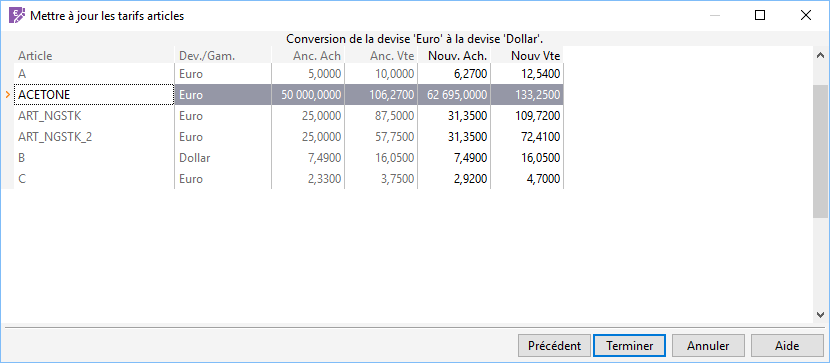

# Consultation et modification

## Consultation des tarifs

Pour tous les articles compris dans la sélection définie, le logiciel 
 indique le code, la devise, l’ancien prix (ou coefficient) et le nouveau.

 

 

Pour la conversion des tarifs, les informations sont les suivantes :

* Article : code article,
* Devise/Gamme 
 : devise société ou devise déjà définie dans la fiche article.

 

Pour les articles gérant les gammes, cette conversion n’est pas prise 
 en compte (les gammes sont mono-devise)

* Anc. Ach : ancien prix d’achat
* Anc. Vte : ancien prix de vente
* Nouv. Ach : nouveau prix d’achat converti en devise, mais [modifiable 
 par l'utilisateur](ConsultationModification.md).
* Nouv. Vte : nouveau prix de vente converti en devise, mais [modifiable 
 par l'utilisateur.](ConsultationModification.md)

## Modification des tarifs

Le nouveau prix peut être modifié manuellement avant de lancer la validation 
 de la mise à jour avec le bouton Terminer. Si toutefois, votre modification 
 ne vous convient pas vous pouvez rétablir les valeurs calculées par le 
 logiciel par un clic droit .

 

Le menu contextuel (clic droit) de cette grille vous permet d'accéder 
 à toutes les fonctions générales d'une grille.

