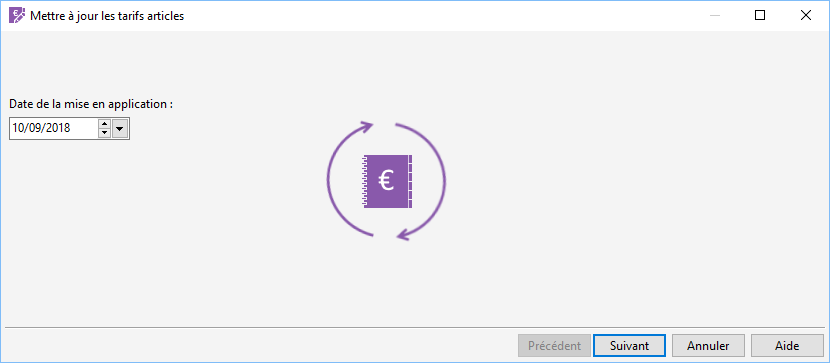

# Date de mise en application

Pour programmer un changement de tarif à l’avance, il suffit de saisir 
 une date de mise en application future (non valable pour la modification 
 du prix de revient). Pour mettre à jour les tarifs dès maintenant, saisir 
 la date du jour.

 

