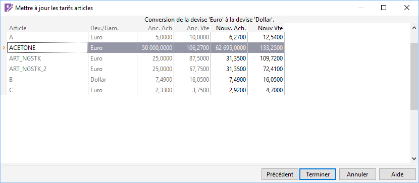

# Exemple de mise à jour des tarifs articles

Prenons 3 articles A, B, C, avec les tarifs spécifiques suivants :

 

A Prix de vente en Euro : 10

B Prix de vente en Euro : 15 et en Dollar : 16. 05

C Prix de vente en Euro : 3,5 et en Livre anglaise : 5. 60

## Comment convertir les tarifs en € en devise Dollar?

Le paramétrage de la sélection des devises dit 
 être De Euro à Euro. Dans le champ [convertir 
 en](CalculsEffectuer.md), sélectionnez Dollar.

 

Le résultat est le suivant :

 

Pour les articles A et C, une ligne de tarif en devise Dollar est ajoutée 
 dans leur [fiche](../1/Article/OngletGeneral/ArticleOngletGeneral.md).

 

Pour l’article B, il n’y a pas de changement entre l’ancien et le nouveau 
 tarif car la devise de conversion choisie existe déjà dans sa [fiche](../1/Article/OngletGeneral/ArticleOngletGeneral.md).

