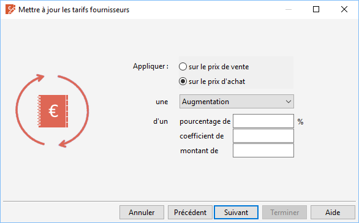

# Calculs à effectuer

La mise à jour des tarifs fournisseurs consiste à réaliser une augmentation 
 ou une diminution des tarifs suivant un pourcentage, un coefficient ou 
 un montant déterminé.

 

## Modification du prix de vente

Le prix de vente modifié est celui indiqué dans [l'onglet 
 Fournisseur](../1/Article/OngletFournisseurs/ArticleOngletFournisseurs.md) de la fiche article.

## Modification du prix d’achat

Le prix d’achat modifié est celui indiqué dans [l'onglet 
 Fournisseur](../1/Article/OngletFournisseurs/ArticleOngletFournisseurs.md) de la fiche article.

