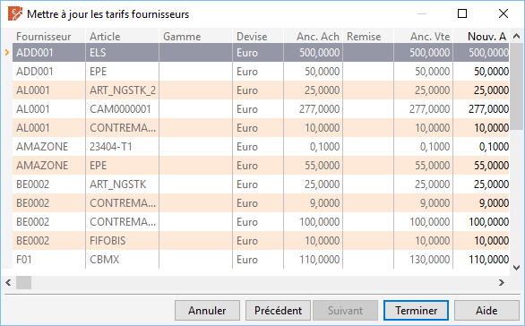

# Consultation et modification

Pour tous les fournisseurs et les articles compris dans la sélection 
 définie, le logiciel indique :

* Le code fournisseur
* Le code article
* La gamme
* La devise
* Les anciens prix d’achat et 
 de vente (ou coefficient)
* La remise
* Les nouveaux prix d’achat 
 et de vente

 

 

Il n’y a aucune modification manuelle possible.

 

Le menu contextuel (clic droit) de cette grille vous permet d'accéder 
 à toutes les fonctions générales d'une grille.

