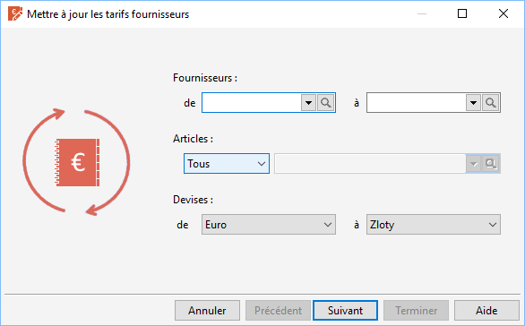

# Sélection des données

## Sélection des fournisseurs

Le choix des fournisseurs peut se réaliser par la liste déroulante ou 
 par la [recherche particulière](../../Tiers/8/MiseJourTiersRecherche.md) 
 de tiers.

## Sélection des articles

Elle s’effectue suivant une sélection d’article normalisée ou par une 
 requête SQL particulière.

 

Le choix peut s’effectuer pour :

* Un article précis 
 (Unique), vous pouvez alors 
 sélectionner un article par la liste déroulante ou par la recherche 
 particulière d'article,
* Une sélection d'articles 
 (Avancée),
* La totalité des 
 articles (Tous).

## Sélection des devises

Par défaut, tous les tarifs sont mis à jour mais vous pouvez sélectionner 
 une fourchette de devises.

