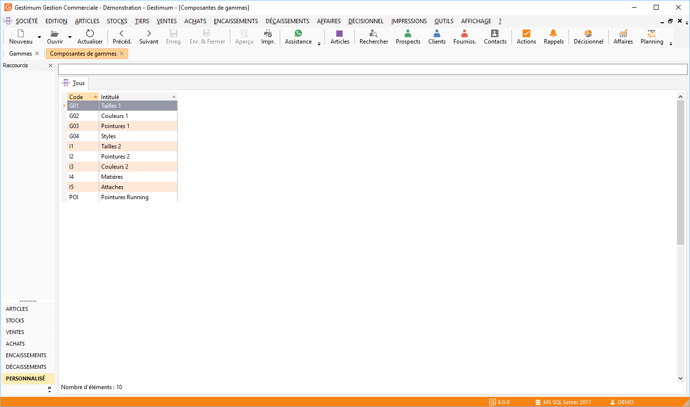
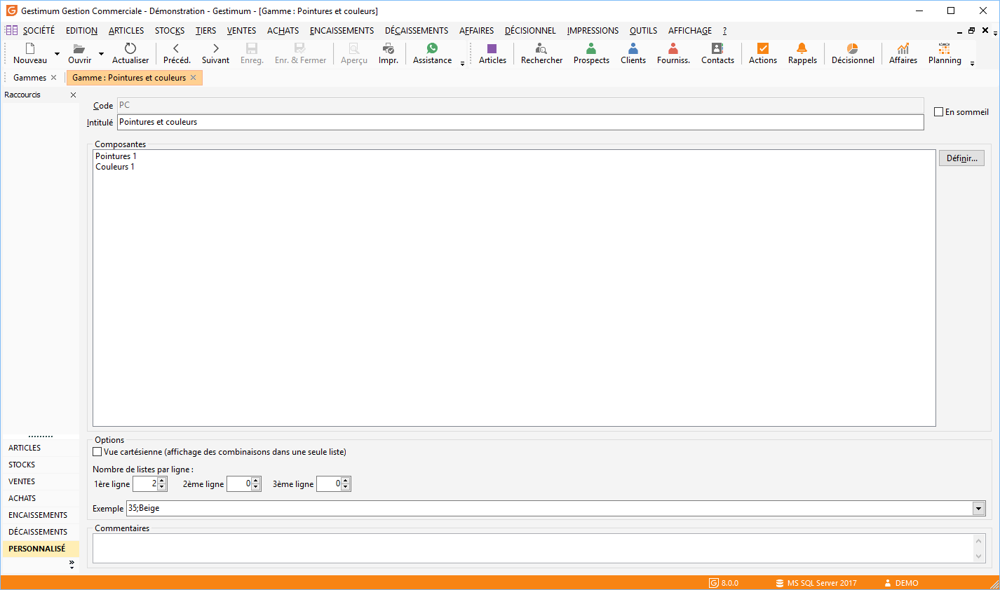

# Exemples de gammes

L’exemple consiste à déterminer les gammes d’un magasin de vêtements 
 et chaussures de différents styles.

## Composantes

Nous pouvons déterminer 4 composantes.

 

## Valeurs des composantes

Nous avons 4 composantes à valoriser.

### 1ère composante : Taille (G01)

### 2ème composante : Couleur (G02)

### 3ème composante : Pointure (G03)

### 4ème composante : Style (G04)

## Combinaison de composantes

Avec ces 4 composantes, nous pouvons déterminer différentes combinaisons 
 de composantes.

 

 

Nous allons composer 3 gammes.

### 1ère gamme : Pointure/Style (PC)

### 2ème gamme : Taille/Couleur (TC)

### 3ème gamme : Taille/Couleur/Style (TCS)

 

La sélection des composantes s’effectue à l'aide de la fenêtre suivante 
 depuis le bouton "Définir" :

 

