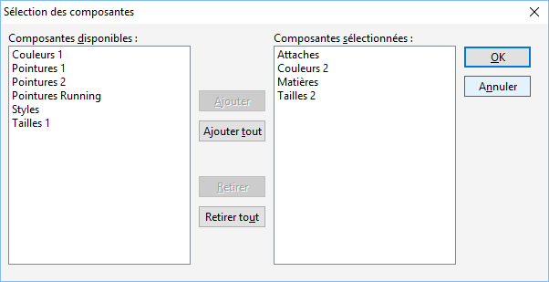

# Composition de la gamme

Cette fenêtre propose à gauche, les composantes de gamme disponibles 
 et à droite les composantes choisies.

 

 

Elle permet de :

* Référencer 
 les composantes de gamme une par une,
* Passer 
 les composantes de gamme de gauche (n° disponibles) vers la liste 
 de droite (n° sortis) et inversement.

 

Les boutons au centre de la fenêtre servent respectivement à Ajouter 
 une, toutes ou la sélection de gammes élémentaires de la liste des gammes 
 élémentaires disponibles vers la liste des gammes élémentaire choisis 
 et inversement.

 

Lorsque la sélection des gammes élémentaires est terminée, cliquez sur 
 OK et si besoin recommencez pour 
 une autre gamme

La composition est alors modifiée en fonction des gammes élémentaires 
 sélectionnées.

 

Pour avoir un exemple de la fenêtre de sélection des gammes élémentaires 
 cliquez ici.

 

[Voir aussi](javascript:RelatedTopic0.Click())

Voir aussi (espace réservé)
 

1. [Liste des rubriques](#)

