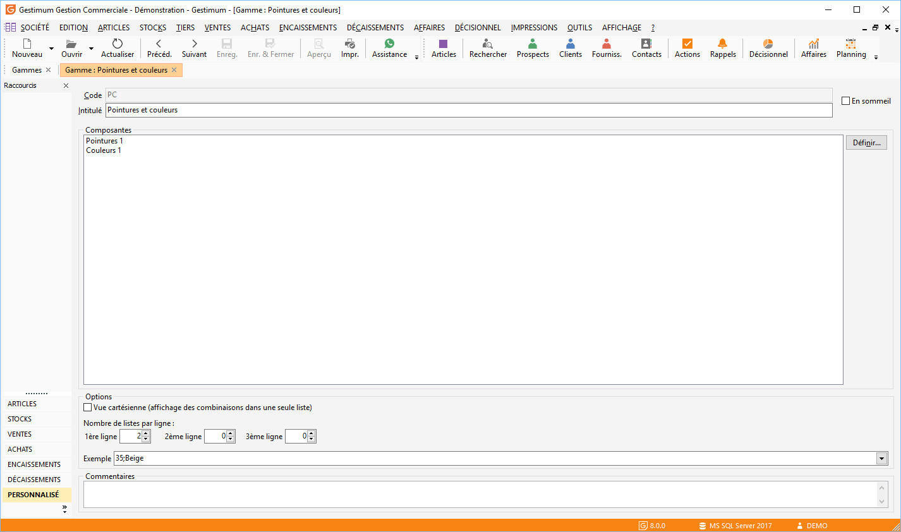
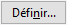

# Gamme

Une fiche gamme détermine la composition de la gamme qui sera affecté 
 à une ou plusieurs fiches articles.

 

Le nombre de gammes est illimité.

 

Une gamme est composée de 4 parties :

* L’identification,
* La composition,
* Les options,
* Les commentaires.

 

Une gamme ne peut-être supprimée si elle est sélectionnée sur [une 
 fiche article](../../4/Articles.md).

 

Le menu contextuel vous 
 permet de créer, ouvrir, enregistrer, supprimer, dupliquer, imprimer et rafraîchir une fiche gamme.

## L’identification

Une gamme doit contenir obligatoirement :

* Un code sur 3 caractères 
 alphanumériques maximum,
* Un intitulé,
* Une gamme élémentaire 
 dans la partie Composition.

## La composition

Cette partie permet de sélectionner les gammes élémentaires qui définissent 
 la gamme.

 

Une gamme est composée au maximum de 9 gammes élémentaires.

 

La sélection des gammes élémentaires s'effectue 
 par le bouton .

 

La [fenêtre de sélection](CompositionGamme.md) des gammes 
 élémentaires vous permet de visualiser les gammes élémentaires disponibles 
 et celles que vous avez choisis.

## Les options

Les options vous permet de déterminer la vue des gammes élémentaire 
 d’une gamme.

 

Vous pouvez voir vos gammes élémentaire en :

* Vue standard 
 : cette vue consiste à sélectionner dans les différentes colonnes 
 (une par élément) les valeurs (exemple),
* Vue cartésienne 
 : coche dans le champs. Elle regroupe les combinaisons des 
 différentes sous-gammes dans une seule fenêtre de saisie (exemple)

Le nombre de lignes affichées au minimum est de 10.

 

La fenêtre de vue des gammes peut-être redimensionnée lors de la création 
 de la gamme, elle sera alors proposée dans tous le logiciel sous la dimension 
 choisie pour toutes les gammes.

 

### Nombre de listes

Pour la vue standard, vous avez la possibilité de positionner les éléments 
 sur 3 lignes avec un maximum de 4 colonnes.

 

Si tous les éléments sont sur une ligne, les données de chaque colonne 
 s’afficheront au minimum sur 8 lignes.

 

Si les éléments sont répartis sur au moins 2 lignes, les données de 
 chaque colonne s’afficheront au minimum sur 5 lignes.

 

Exemple: Il vous permet de visualiser la vue de la gamme qui vous sera 
 proposée lors de la saisie de l’article auquel cette gamme est affecté.

## Les commentaires

Les commentaires font références à la gamme

 

Pour avoir un exemple de fiche gammes cliquez ici.

 

