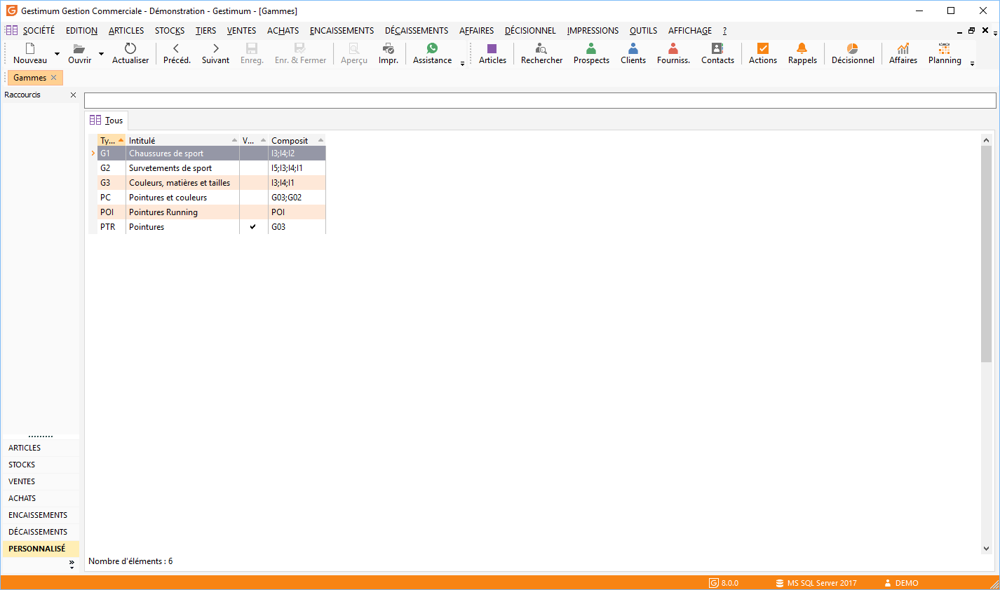

# Liste des gammes

La liste des gammes est accessible (sauf en mode Fiche) à partir de 
 la commande Articles du menu Données et donne accès à la gestion des fiches 
 [gammes](Gamme/Gamme.md) qui s’effectue à partir de la barre 
 d'outils, du menu contextuel ou des raccourcis claviers.

 

 

En mode Fiche, la liste est accessible à partir de la fiche gamme par 
 simple clic sur l’icône Ouvrir de la barre d’outils.

 

Toutes les listes ont un fonctionnement commun.

 

Pour avoir un exemple de liste des gammes cliquez ici.

 

