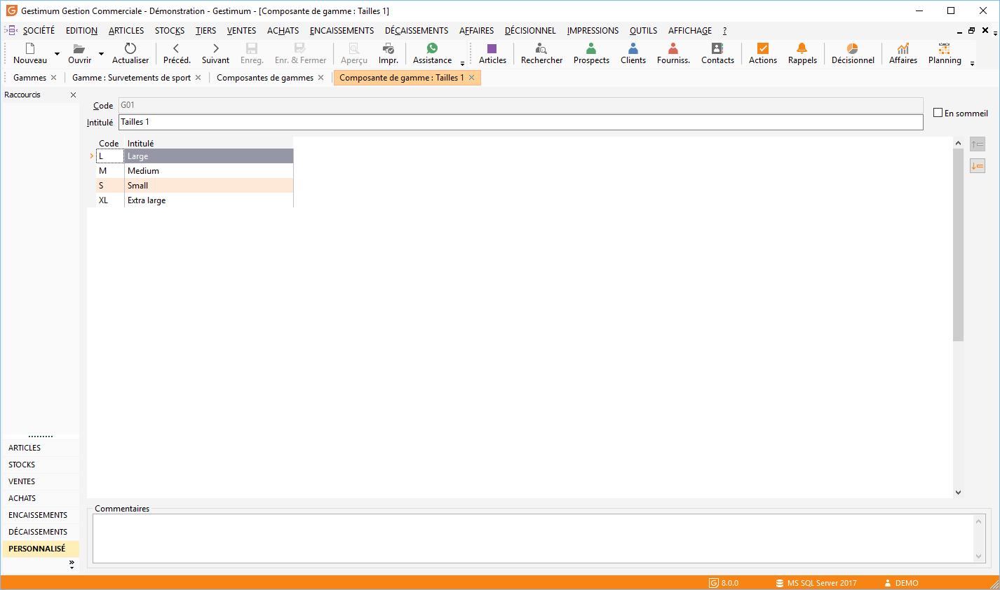

# Composante de gamme

Elles représentent les éléments de base des gammes et contiennent les valeurs possibles.

 

Le nombre de composantes de gamme est illimité.

 

Une fiche de composante de gamme est composée de 3 parties :

* L’identification,
* Les valeurs possibles,
* Les commentaires.

 

Une composante de gamme ne peut-être supprimée si elle est présente dans la [composition d'une gamme](../2/Gamme/Gamme.md).

 

Le menu contextuel vous permet de créer, ouvrir, enregistrer, supprimer, dupliquer, imprimer et rafraîchir une fiche composante de gamme.

## L’identification

Une composante de gamme doit contenir obligatoirement :

* Un code sur 10 caractères alphanumériques maximum,
* Un intitulé.

## Les valeurs possibles

Elles représentent toutes les valeurs que vous pourrez sélectionner lors de la réalisation de vos documents.

 

La saisie des valeur possibles consiste à saisir :

* Un code sur 10 caractères alphanumériques maximum,
* Un intitulé.

 

Il est possible d’ordonner l’affichage des valeurs à l’aide de flèches orange situées à droite de la grille.

 

Le menu contextuel de la grille des valeurs vous permet d’accéder aux fonctions générales des grilles mais également d'insérer ou de supprimer une valeur.

## Les commentaires

Les commentaires font références à la composante de gamme.

 

