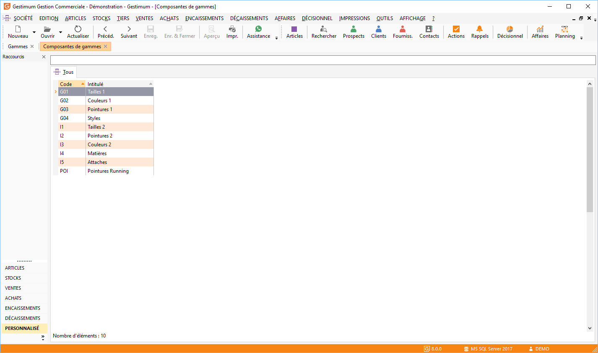

# Liste des composantes de gammes

La liste des composantes de gammes est accessible (sauf en mode Fiche) à partir de la commande Articles du menu Données et donne accès à la gestion des [fiches de composantes de gammes](ComposanteGamme.md) qui s’effectue à partir de la barre d'outils, du menu contextuel ou des raccourcis claviers.

 

 

En mode Fiche, la liste est accessible à partir de la fiche gammes par simple clic sur l’icône Ouvrir de la barre d’outils.

 

Toutes les listes ont un fonctionnement commun.

 

[Voir aussi](javascript:RelatedTopic0.Click())

Voir aussi (espace réservé)

1. [Liste des rubriques](#)

