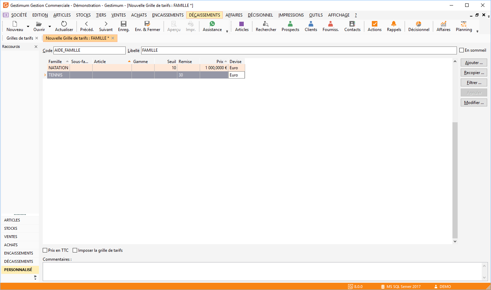
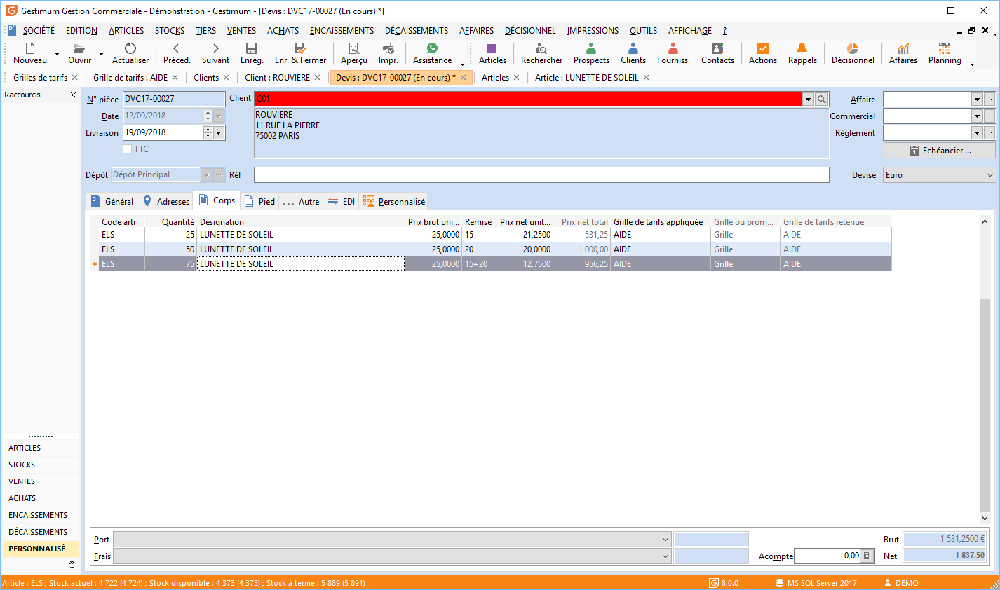

# Grilles de tarifs de A à Z

Sur Gestimum ERP il est possible de créer des "grilles de tarifs" 
 articles que vous pourrez affecter à vos tiers

## La grille de tarifs

L'accès se fait via le menu "ARTICLES/Grilles 
 de tarifs".

 

Vous pouvez créer une nouvelle grille soit avec 
 le bouton Nouveau soit dans le menu contextuel.

### Les lignes de la grille de tarifs

Vous pouvez créer autant de lignes de tarifs 
 que de conditions particulières applicables à un même tiers ou à une famille 
 de tiers

 

### Remise sur familles, sous-familles d’articles et sur articles

Saisissez le code de la famille, de la sous-famille 
 ou de l’article puis saisir la valeur de la remise

 

Vous pouvez sélectionner plusieurs articles 
 en même temps en cliquant sur la case "Ajouter" sur la partie 
 droite de la fenêtre

 

Cas particulier : pour les articles 
 gérant les gammes, vous n’êtes pas obligé de sélectionner les éléments 
 de la gamme. Si vous souhaitez appliquer un tarif particulier à une gamme 
 précise, vous devez sélectionner celle-ci.

 

Vous pouvez appliquer une remise unique ou des 
 remises en cascade. Une éventuelle majoration peut également être paramétrée 
 avec le signe ‘‘ devant la valeur dans la colonne "prix" (2% 
 applique une majoration du prix de 2%).

 

Si la remise dépend de la quantité vendue, saisissez 
 la quantité dans la colonne Seuil.

Si le prix dépend de la quantité vendue ou achetée, 
 saisissez dans la colonne Seuil, la quantité à partir de laquelle le prix 
 sera appliqué.

 

### Prix en devise

Saisir la référence de l’article, éventuellement 
 sa gamme et son prix (par défaut en devise société).

 

Pour définir des prix en devise, indiquez le 
 code de la devise dans la colonne Devise.

 

### Rendre obligatoire cette grille de tarifs

Le logiciel par défaut sélectionnera toujours 
 le meilleur prix pour le client, si vous souhaitez que Gestimum prenne 
 cette grille plutôt que le prix de l’article seul cochez en bas " 
 Grille de tarifs imposée".

 

## Affectation de la grille à un tiers

Allez dans une fiche client ou fournisseur puis 
 dans l’onglet "Admin".

Puis sélectionnez la grille de tarifs que vous 
 souhaitez appliquer à ce tiers.

 
## Le document de vente/achat

Au moment de votre document de vente/achat faites 
 apparaître la colonne "Grille de tarifs" (en faisant clic droit 
 "propriétés de la grille – grille de tarif"). Quand vous sélectionnez 
 votre tiers puis les articles de la grille de tarifs, les informations 
 apparaîtront bien.

 

## Les remises en cascade

Les remises en cascade peuvent s’appliquer à 
 une famille, une sous-famille d’articles ou à un article précis. Vous 
 pouvez appliquer jusqu’à 6 remises en cascade.

 

La remise en cascade peut s’appliquer sur :

* Une ligne unique de tarif

Pour cette ligne de tarif, saisir dans la 
 colonne Remise, chacune des remises séparées par le signe +. Par exemple 
 : 10+5+4

* Plusieurs 
 lignes de tarif

Lorsque les remises dépendent d’un seuil 
 de quantité, créer autant de lignes de tarif qu’il y a de seuils de remise 
 à distinguer.

 

Saisir alors dans chaque ligne de tarif le signe + suivi de la remise 
 (à l’exception de la première ligne).

 

Dans un document de vente/achat automatiquement le logiciel reprendra 
 ces informations pour calculer la remise.

 

## Les exemples

### Exemple 1

Deux remises sur article sont appliquées : 10% puis 5%. Les deux remises 
 s’appliqueront l’une après l’autre automatiquement selon la formule.

 

Prix  – "Remise1" 
 - "Remise2"

Avec :

Remise 1 = Prix \* Taux 
 "Remise1" / 100

Remise 2 = (Prix - Remise1) 
 \* Taux "Remise2" 
 / 100

 

Pour un prix article de 10 Euros, vous obtenez un prix remisé de 8,55 
 : 

10 - 1 - 0,45

Avec

1 = 10 \* 10 / 100 

0,45 = (10 - 1) \* 5 / 100

### Exemple 2

Une première remise de 10% est 
 appliquée sur un article puis une remise supplémentaire de 5% 
 à partir de 50 articles vendus/achetés 
 s’applique

 

La première remise (10%) s’applique pour toute vente ou achat de l’article.

 

La deuxième remise intervient uniquement si la quantité d’articles vendus/achetés 
 est supérieure ou égale à 50. Dans ce cas, la remise s’applique sur le 
 prix remisé précédent (voir formule précédente).

### Exemple 3

Une remise de 10% sur une famille 
 d’article ou une remise de 15% 
 à partir de 50 articles vendus/achetés 
 sont appliquées. Chaque remise s’applique pour un certain nombre d’articles 
 vendus/achetés, il n’y a pas de remise en cascade.

### Exemple 4

Pour un même article, deux prix sont définis : l’un en euro (ou devise 
 société), l’autre en dollars.

 

En réalisation de document, le tarif sera appliqué suivant la devise 
 de celui-ci.

