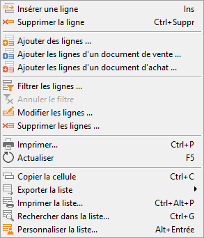
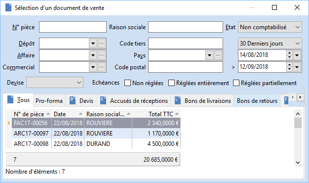
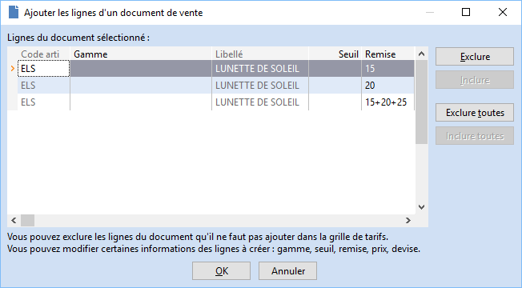

# Ajouter les lignes d'un document d'achat vente dans une grille de tarifs

Dans une grille de tarifs, depuis le menu contextuel nous avons deux 
 fonctions :

* Ajouter les lignes d'un document de vente ...
* Ajouter les lignes d'un document d'achat ...

 

 

Selon la fonction choisie (vente ou achat), cela ouvre une nouvelle 
 fenêtre de sélection du document de vente ou d'achat :

 

 

Dans cette fenêtre, on ne peut sélectionner un document par double-clic 
 ou par clic-droit puis "Sélectionner" ou la touche clavier Entrée.

 

On affiche alors les lignes articles de ce document dans une nouvelle 
 fenêtre (les lignes texte, total, sous-total sont ignorées).

 

On reprend les informations suivantes du document : l'article, la gamme 
 si article gammé, le prix brut de la ligne et la remise si il y en a une.

 

 

Dans cette fenêtre on peut modifier certaines informations : gamme, 
 seuil, remise, prix et devise.

  

Les autres informations ne sont pas modifiables.

 

On peut également exclure / inclure certaines ou toutes les lignes (par 
 double-clic sur la ligne, par les boutons prévus à cet effet ou encore 
 via le menu contextuel.).

 

Attention, on ne peut pas avoir plusieurs fois un même article dans 
 une grille de tarifs, par conséquent lorsqu'on part d'une grille de tarifs 
 déjà existante, les lignes des articles déjà présents dans la grille sont 
 automatiquement exclues.  

Si on part d'une nouvelle grille de tarifs, les articles présents plusieurs 
 fois dans le document sont affichés dans la fenêtre de sélection, l'utilisateur 
 doit alors exclure les lignes en double pour ne conserver qu'une ligne 
 par article avant de pouvoir valider l'ajout des lignes dans la grille 
 de tarifs.

