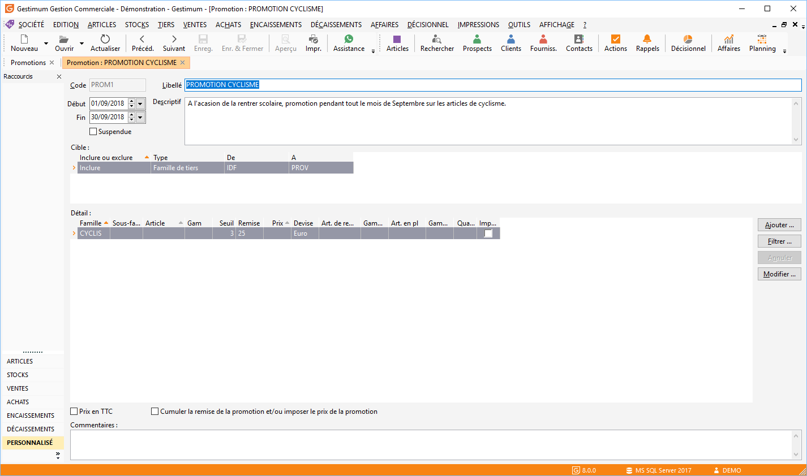

# Promotion

Une promotion est décrite par son code (sur 10 caractères maximum), 
 son libellé, la période d’application, la population concernée et au moins 
 une ligne de promotion.

 

## Sélection de la période de la promotion

La promotion ou les soldes s’appliqueront du premier jour ou dernier 
 jour de la période indiquée ici.

 

La case à cocher "Suspendue" 
 vous permettra de bloquer la promotion pendant la période en cours. De 
 ce fait lors de la consultation de tarif ou de la réalisation de document, 
 celle ci ne sera pas prise en compte.

## Population de tiers concernée par la promotion

La promotion s’applique par défaut sur la totalité de vos clients et 
 de vos prospects mais il est possible de préciser une population de tiers 
 donnée: famille ou sous-famille de tiers, pays particulier.

 

Cette précision s’effectue sous forme de grille qui permet d’exclure 
 et inclure les tiers, familles, sous-familles et pays que vous souhaitez.

## Saisie des lignes de promotion

Une ligne de promotion permet :

* D’appliquer 
 des remises sur une famille, une famille + sous-famille d’articles 
 et un article donné,
* De préciser 
 un prix promotionnel de vente dans une devise pour une famille, une 
 famille + sous-famille d’articles et un article donné,
* De paramétrer 
 un article de remplacement,
* De préciser un 
 article supplémentaire (gratuit) 
 pour l’achat ou la vente d’un article donné ou d’un article d’une 
 famille ou une sous-famille,
* De préciser la 
 quantité d’article supplémentaire 
 que vous souhaitez.

### Remises et prix promotionnels

Ces lignes de promotions fonctionnent comme des lignes de tarifs dans 
 une grille de tarifs.

### L’article de remplacement

L’article de remplacement permet de vendre, pendant toute la durée de 
 la promotion, un article à la place d’un autre tout en conservant le prix 
 de l’article d’origine.

### L’article en plus (gratuit)

Pour offrir un article (gratuit) pour tout achat/vente d’un article 
 précis ou d’un article appartenant à une famille ou une sous-famille d’articles, 
 il faut saisir la référence de l’article puis dans la colonne Article 
 en plus, la référence de l’article gratuit. De ce fait, l’article gratuit 
 sera bien décrémenté du stock actuel à un prix de vente nul.

### Cas particulier

Vous pouvez déterminer une promotion pour [une 
 gamme](../../Gammes/2/Gamme/Gamme.md) particulière par un clic dans la colonne ‘gamme’ de la grille 
 de saisie. La sélection des éléments de la gamme s’effectue par une vue 
 déterminée au préalable dans [la 
 fiche gamme](../../Gammes/2/Gamme/Gamme.md) ([vue cartésienne](../../Gammes/2/Gamme/VuesStandardCartesienne.md) ou [vue standard](../../Gammes/2/Gamme/VuesStandardCartesienne.md)).

## Gestion de la grille

Le menu contextuel et les boutons (Ajouter, Filtrer, Annuler le filtre, 
 Modifier) permettent de gérer plus simplement les grilles volumineuses.

 

Pour avoir plus de détail sur le fonctionnement de ces options cliquez 
 ici.

 

Le menu contextuel (clic droit) de cette grille vous permet :

* D’insérer 
 une ligne (Ins),
* De supprimer 
 une ligne (Ctrl + Suppr),
* De supprimer 
 toutes les lignes,
* Gérer 
 les créations et modifications de lignes,
* D’imprimer 
 suivant un modèle précis,
* De rafraîchir 
 la grille de saisie,
* D’accéder à toutes 
 les fonctions générales d'une grille.

//<![CDATA[
 if( typeof( FilePopupInit ) != 'function' ) FilePopupInit = new Function();
 FilePopupInit('a1');
 FilePopupInit('a2');
//]]>
