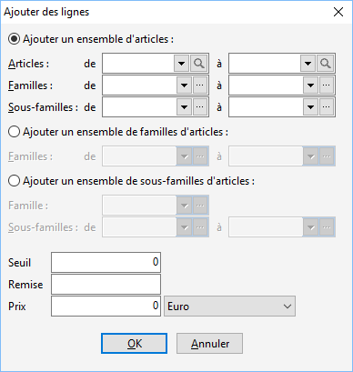

# Ajouter des lignes de grilles de tarifs et promotions

Cette fonction permet d’ajouter des lignes de tarifs sur les grilles 
 de tarifs ou promotions en fonction :

* d’un ensemble d’article : fourchette d'articles ou familles 
 d’articles ou sous-familles d’articles
* d’un ensemble d’articles 
 appartenant à une famille précise : ce nouveau tarif sera appliqué 
 sur tous les articles appartenant à cette famille

 

 

Suite à la sélection d’articles pour lesquels le tarif sera appliqué, 
 vous devez déterminer le tarif :

* Le seuil
* La remise
* Le prix 
 dans la devise souhaitée

 

Il n’est pas obligatoire de saisir dans ces 3 champs. Vous pouvez déterminer 
 par exemple :

* Un seuil pour un 
 prix
* Un seuil pour une 
 remise
* Une remise uniquement
* Un prix …

