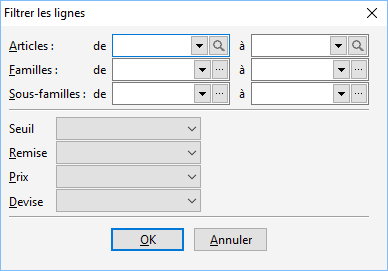

# Filtrer les lignes de grilles de tarifs et promotions

Cette fonction permet de sélectionner une partie de la Grille de tarifs 
 ou de la Promotion que l’on souhaite visualiser, modifier …

 

 

Cette sélection s’effectue suivant :

* Une fourchette 
 d’articles
* Une fourchette 
 de familles d’articles
* Une fourchette 
 de sous-familles d’articles

 

Suite à la sélection d’articles, vous pouvez déterminer si vous souhaitez 
 ou non que les champs suivant soit renseignés :

* Le seuil
* La remise
* Le prix

 

Sur chaque champ, vous avez la possibilité de sélectionner si vous souhaitez 
 :

* Ne pas mettre de 
 condition sur ce champ (sélection à "vide")
* Avoir ce champ 
 de rempli (avec)
* Ne pas avoir ce 
 champ de rempli (sans)

 

Vous pouvez également sélectionner les lignes que concerne une devise précise.

 

Suite à la réalisation de ce filtre, votre grille de tarif ou promotion 
 est affichée uniquement pour les lignes sélectionnées. Vous pouvez alors 
 faire les modifications nécessaires. Pour visualiser votre grille de tarif 
 ou promotion en totalité, vous devez annuler le filtre.

