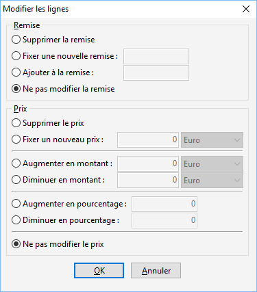

# Modifier les lignes de grilles de tarifs et promotions

Cette fonction permet de changer les remises et les prix des lignes 
 d’une Grille de tarifs ou d’une Promotion.

 

 

Les changements possibles pour une remise sont :

* Supprimer 
 la remise de la ligne sélectionnée
* Fixer 
 une nouvelle remise: cette remise remplacera l’existante
* Ajouter 
 à la remise : le chiffre saisi s’additionnera à la remise existante
* Ne 
 pas modifier la remise : aucun changement (cette option est 
 sélectionnée par défaut)

 

Les changements possibles pour un prix sont :

* Supprimer 
 le prix de la ligne sélectionnée,
* Fixer 
 un nouveau prix : ce prix remplacera l’existant,
* Augmenter 
 en montant : Le prix existant sera ajouté au montant saisi 
 dans ce champ,
* Diminuer 
 en montant : Le prix existant sera diminué du montant saisi 
 dans ce champ,
* Augmenter 
 en pourcentage : Le prix existant sera augmenté du pourcentage 
 saisi dans ce champ,
* Diminuer 
 en pourcentage : Le prix existant sera diminué en fonction 
 du pourcentage saisi dans ce champ,
* Ne 
 pas modifier le prix : aucun changement (cette option est sélectionnée 
 par défaut).

