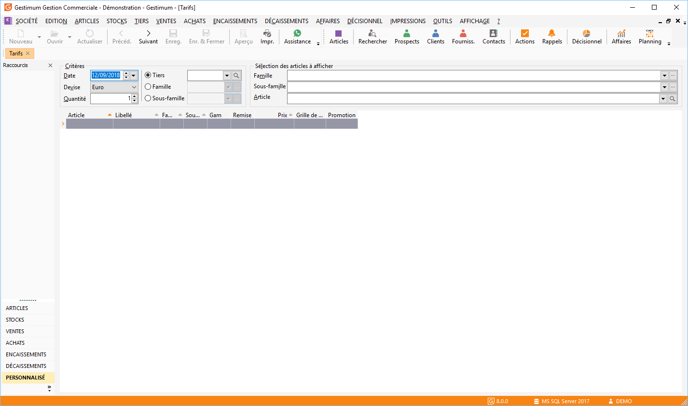

# Consultation des tarifs des articles

La Consultation des Tarifs à partir du menu ARTICLES 
 | Tarifs permet d’obtenir le tarif d’une sélection d’articles, 
 calculé en fonction de critères de calcul : date, devise, quantité minimum, 
 tiers, famille de tiers, sous-famille de tiers.

 

## Critères de calcul des tarifs

L’entête de votre fenêtre de consultation vous permet de définir les 
 critères de calcul des tarifs à consulter.

### Date

La date du jour est automatiquement proposée. Celle-ci permet la recherche 
 d’une [promotion](../2/Promotion.md) en cours.

### Devise

Sélectionnez la devise du tarif que vous souhaitez obtenir. A la première 
 utilisation, la devise société est automatiquement proposée. Ensuite la 
 dernière devise sélectionnée sera automatiquement reprise.

### Quantité

La quantité indiquée ici est comparée au seuil de quantité indiqué dans 
 vos [lignes de tarifs](../1/Fiche.md) et vos [lignes 
 de promotions](../2/Promotion.md).

### Tiers / famille de tiers / sous-famille de tiers

Sélectionnez un tiers, une famille ou une sous-famille de tiers précis, 
 pour obtenir les tarifs calculés en fonction de la grille de tarifs associée 
 éventuellement à la fiche du tiers, de la famille ou de la sous-famille 
 de tiers.

### Sélection des articles à afficher

Une sélection d’articles doit obligatoirement être définie. Vous pouvez 
 demander les tarifs de tous les articles d’une famille, d’une sous-famille 
 ou d’un seul article.

## Liste des tarifs

La liste des tarifs est mise à jour en fonction des critères définis 
 dans l’entête de la fenêtre.

 

Chaque ligne de tarif est décrite par :

* Le code article,
* Son libellé,
* Éventuellement 
 la famille et la sous-famille de l’article,
* Le tarif de vente 
 à la date indiquée,
* La remise appliquée,
* Éventuellement 
 le code et le nom de la promotion,
* Ou encore le code 
 de la grille de tarif.

 

Si l’article gère [les gammes](../../Gammes/2/Gamme/Gamme.md), 
 les colonnes type de gamme et gamme sont renseignées.

 

Par le menu contextuel ou les raccourcis clavier, vous pouvez accéder 
 :

* à La fiche de l'article 
 (Entrée),
* à La grille de 
 tarif retenue,
* à La promotion 
 retenue,
* à L’impression 
 de la consultation (Ctrl + P),
* Aux fonctions générales 
 d'une grille.

