# Impression d'un relevé de factures

## Options

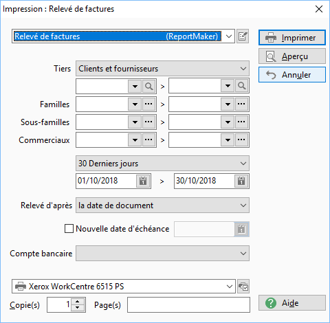

## Exemples

### Relevé de factures

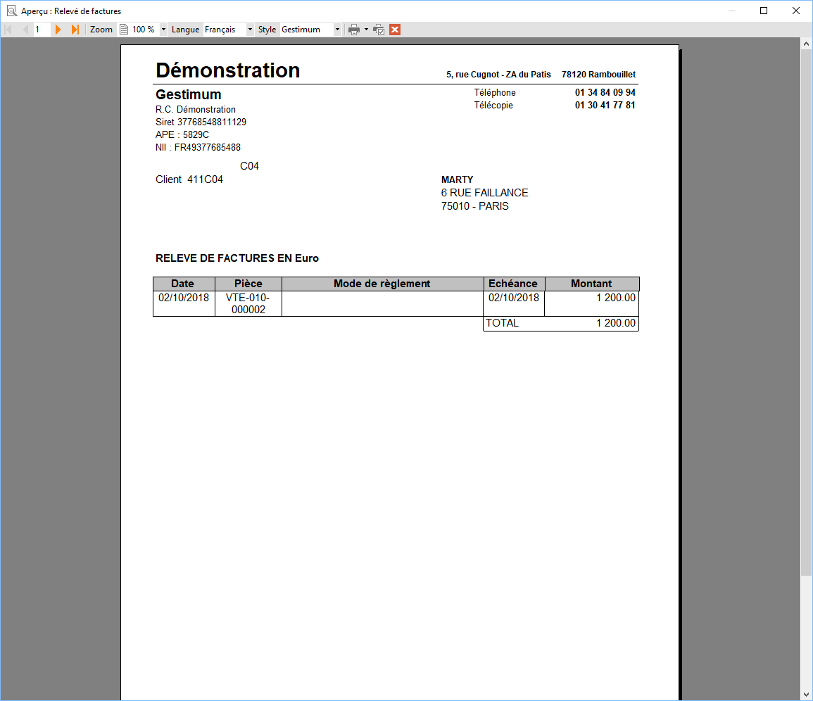

### Relevé de factures avec traite

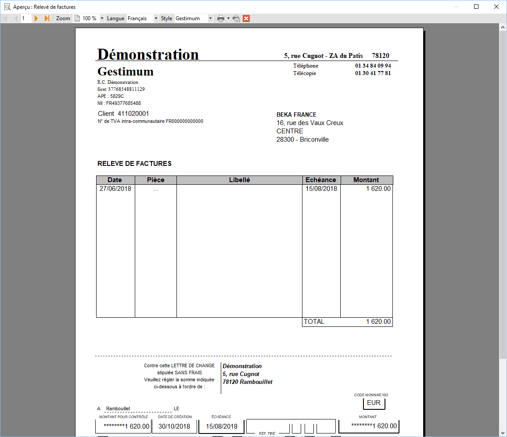

### Relevé de factures avec traite avec mode de règlement

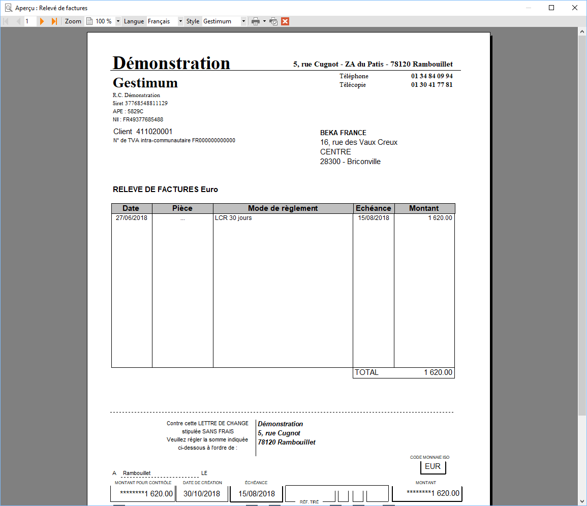

### Relevé de factures avec traite par client

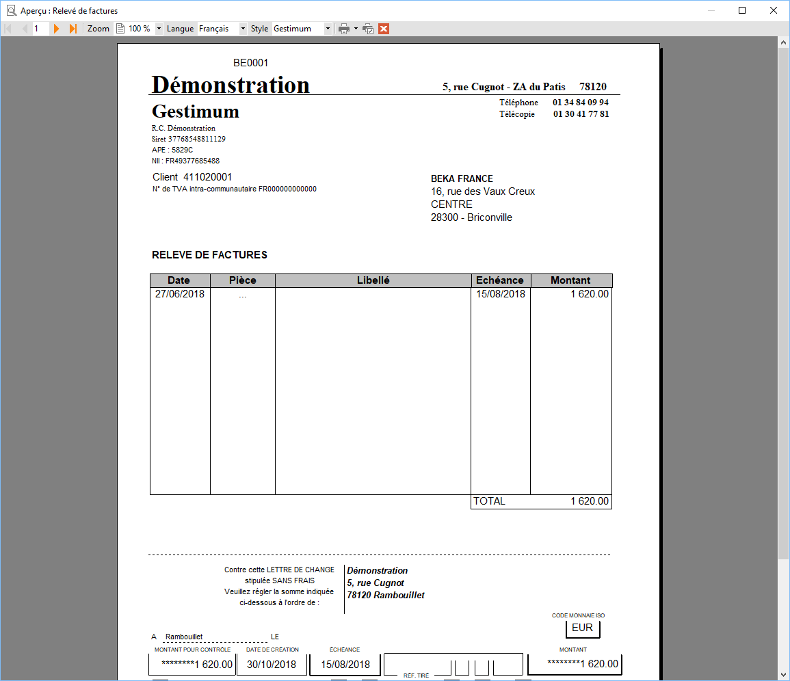

### Relevé de factures avec traite par date d'échéance

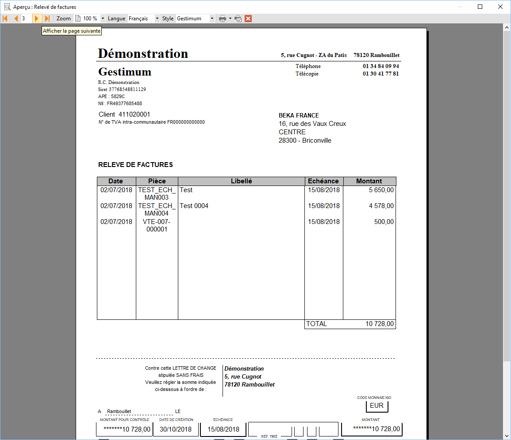

### Relevé de factures sans traite

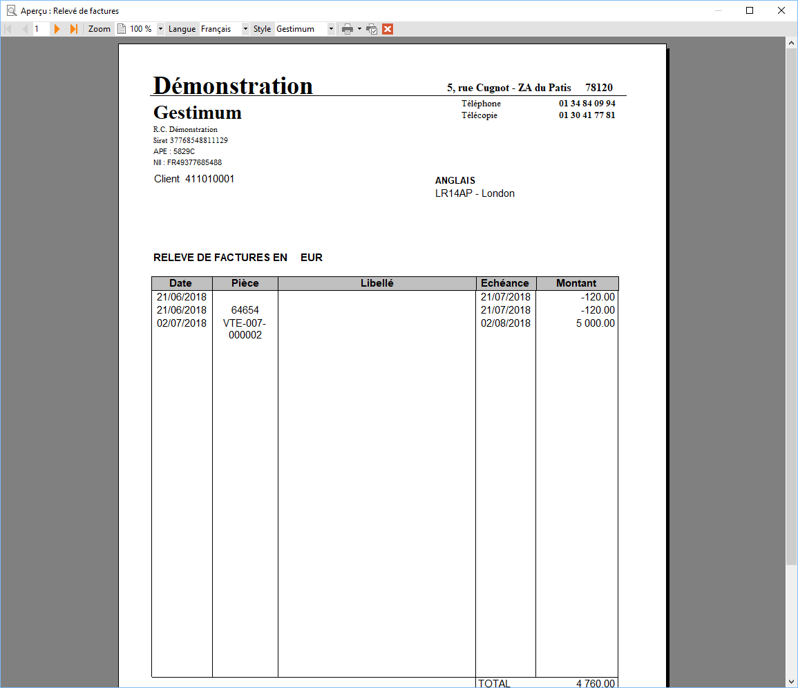

### Relevé de facture sans traite par code client

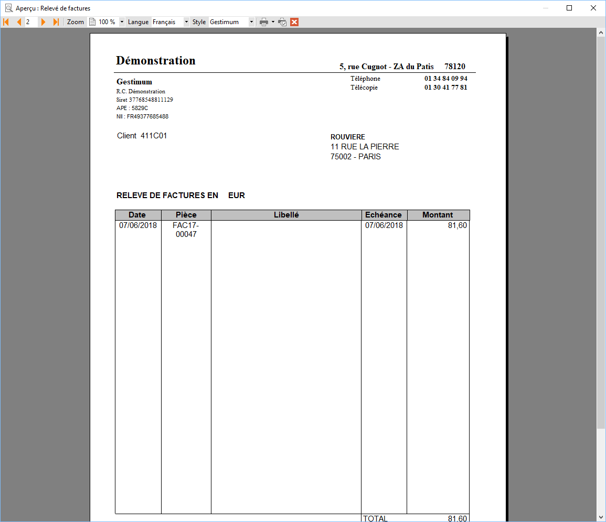

### Relevé de factures sans traite avec mode de règlement

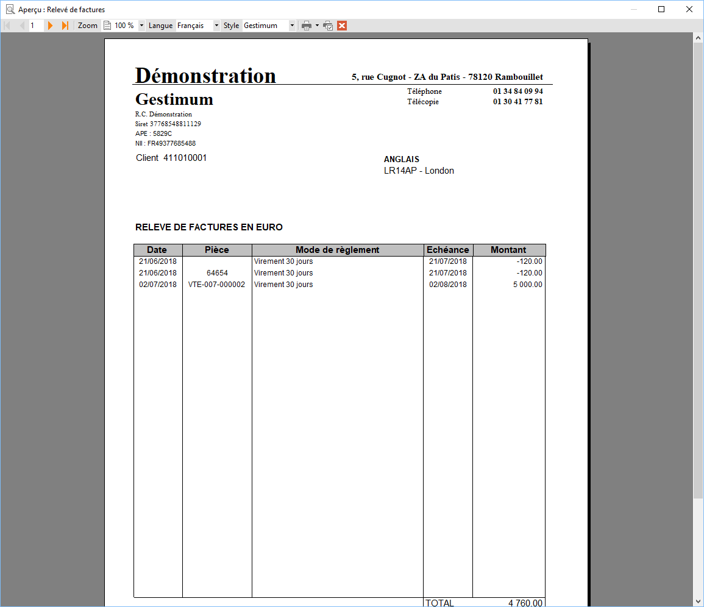

### Relevé par facture sans traite

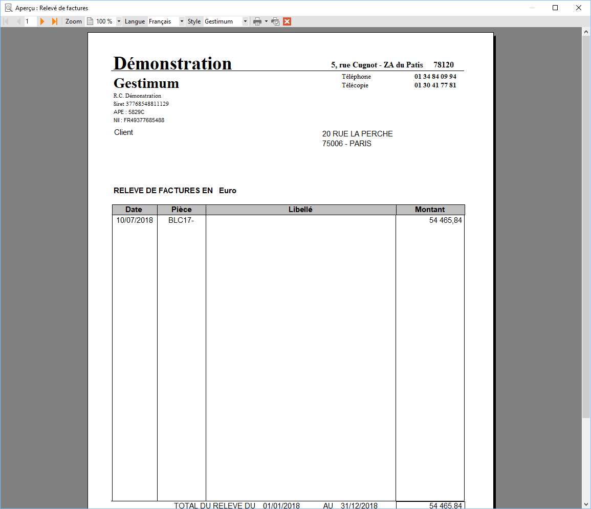

### Traite unique par tiers et date d'échéance

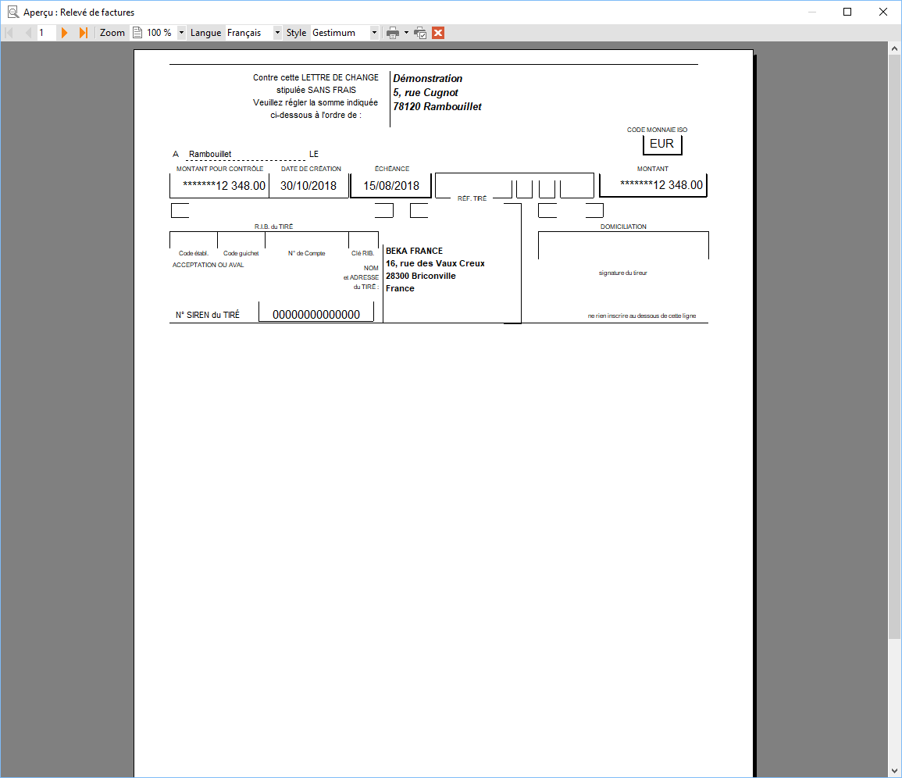

