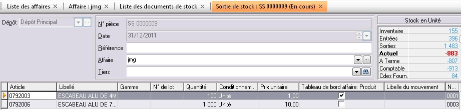
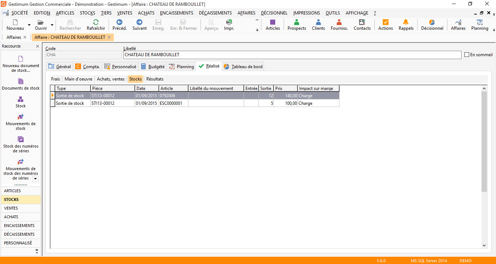

# Colonne affaire dans les documents de stock

La colonne "Tableau de bord affaire : Produit" dans une sortie de stock permet d’avoir un impact positif sur le calcul de la marge dans le tableau de bord des affaires.

 

A l’inverse pour les entrées en stock où la colonne "Tableau de bord affaire : Charges" permet d’avoir un impact négatif sur le calcul de la marge dans le tableau de bord des affaires.

 

La colonne "Impact sur marge" permet de visualiser si le mouvement de stock est une charge ou un produit pour le calcul de la marge sur une affaire.

