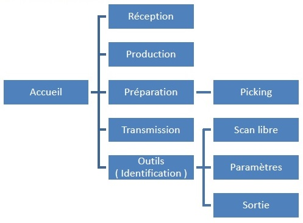
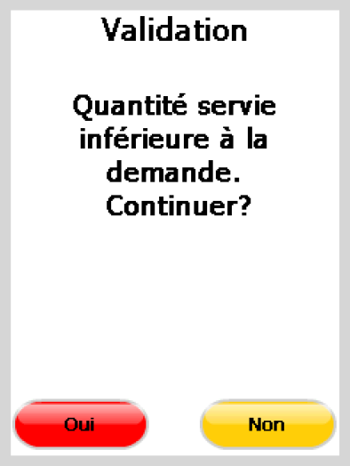

Entrée en stock et commande client à l'aide d'une douchette

## Le terminal : Casio DT-X8

## Enchaînement des écrans de la douchette

## Écran principal de la douchette

## Etape 1 : Réception de matière

1 – Scan des fûts en réception avec code-barres 
 article et code-barres numéro de lt, puis saisie de la quantité:

 

 

2 – Déchargement du lecteur code-barres.

 

Cela va générer un fichier comme dans l’exemple ci-dessous avec les 
 codes articles, les numéros de lots et les quantités :

 

  
3 – Création d’une entrée en stock :

 

Allez dans les documents de Stocks / Nouveau Document / Entrée en stock

 

Cliquez sur «Importer» et sélectionnez le fichier à importer.

 

Cela va vous permettre de générer votre entrée en stock avec les quantités 
 scannées :

 

 

Informations que l’on pourra retrouver dans la consultation du stock 
 :

 

## Etape 2 – Préparation de la commande

1 – L’opérateur sélectionne dans Gestimum les commandes à préparer puis 
 les exporte pour générer les fichiers qui seront importés dans le lecteur 
 code-barres

 

2 - L’opérateur charge les commandes dans le 
 lecteur code-barres, puis il scanne le code-barres du numéro de la commande 
 sur l’impression papier (Point 2) pour définir la commande à préparer, 
 ou il sélectionne sur le lecteur code-barres la commande dans la liste 
 :

 

 

Après sélection de la commande à préparer, il obtient le détails des 
 articles présents dans la commande :

 

 

Après Scan du code-barres article l’opérateur 
 arrive sur la fenêtre d’affectation, le code-barres article contenant 
 également le numéro de lot ce dernier est automatiquement renseigné:

 

 

Une confirmation peut-être demandée si la quantité affectée est inférieure 
 à celle commandée:

 

  

Un contrôle est également fait pour ne pas pouvoir dépasser les quantités 
 commandées 
 

 

Une fois l’ensemble des articles de la commande scannés vous pouvez 
 obtenir ce message:

 

 

3 - Déchargement du lecteur code-barres, cela 
 va générer un fichier reprenant les articles scannés avec leurs numéros 
 de lots.

 

Les quantités seront regroupées pour un même 
 numéro de lt mais les articles restent détaillés par lots différents

 

  

 4 –Ce fichier sera à importer dans Gestimum lors du transfert de 
 la commande en bon de livraison: 
  

 

