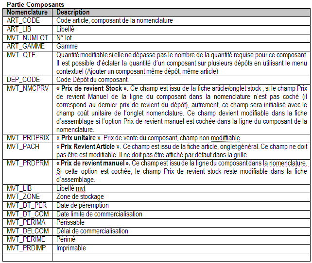

# Composants

La grille des composants reprend automatiquement les composants définis 
 dans la fiche de la nomenclature courante. Le logiciel calcule la disponibilité 
 de chaque composant dans le dépôt précisé sur la ligne de la nomenclature.

## Ligne composant

La ligne de nomenclature est composée d’une référence article, d’un 
 libellé, d’une quantité, du dépôt du composant (qui reste modifiable) 
 et éventuellement d’un libellé de mouvement.

 

Chacun des composants peut être traité à partir d’un dépôt distinct.

 

Vous avez la possibilité de référencer des articles non gérés en stock. 
 Lors de l’assemblage, un mouvement de stock fictif sera généré pour cet 
 article [une ligne ART\_MVT est générée avec MVT\_STOCK = ’N’].

 

Composant gérant les gammes ou les lots ou les numéros de série :

* Pour les articles 
 gérants les gammes ou les lots, vus devez obligatoirement saisir la 
 gamme ou le numéro de lot du composant,

* Pour les articles 
 sérialisés, il est nécessaire de préciser le numéro de série de l’article 
 par le menu contextuel "numéros de série du composant. . . ". 
 Si toutes fois, vus n’avez pas affecté de numéros de série lors de 
 l’enregistrement de la pièce, la fenêtre d’affectation des numéros 
 de série s’ouvrira automatiquement.

## Modification des éléments constituant la nomenclature

A partir du menu contextuel ou des raccourcis clavier, plusieurs options 
 vous sont proposées :

* Ajouter un composant 
 avec le même article dans la limite de la quantité requise pour l’article 
 nomemclaturé (Ctrl+Ins) ;
* Ajouter des composants 
 (article équivalent ou de remplacement) avec le même dépôt dans la 
 limite de la quantité requise pour l’article de type nomenclature 
 (Maj+Ins) ;
* Supprimer un composant 
 (Ctrl+Suppr). Il est toutefois impossible de supprimer totalement 
 une ligne de composant et ses équivalents;
* Consulter le stock 
 de l'article composant ainsi que ses équivalences (CTRL+E) ;
* Ouvrir automatiquement 
 la fenêtre de consultation du stock de l'article pour affecter la 
 gamme ou le numéro de lot;
* Sélectionner le 
 numéro de série du composant (Ctrl + R) ;
* Passer à la grille 
 des articles nomenclaturés (Ctrl+W);
* Décomposition par 
 défaut: Elle correspond à la composition d’origine des composants 
 paramétrée dans l'onglet nomenclature de l'article(Ctrl + M);
* Suite à plusieurs 
 modification, affecter un dépôt commun à tous les composants (Ctrl 
 + D) ;
* Suite à la modification 
 de la composition de la nomenclature, actualiser le prix de revient 
 de l’article nomemclaturé (Ctrl+A);
* Ouvrir la fiche 
 de l'article (Ctrl+C);
* Avoir l'historique 
 de l’article : historique des documents réalisés pour cet article 
 (Ctrl+H) ;
* Imprimer la fiche 
 d’assemblage (Ctrl+P) ;

## Paramétrer les propriétés de la liste de saisie (Alt + Entrée)

