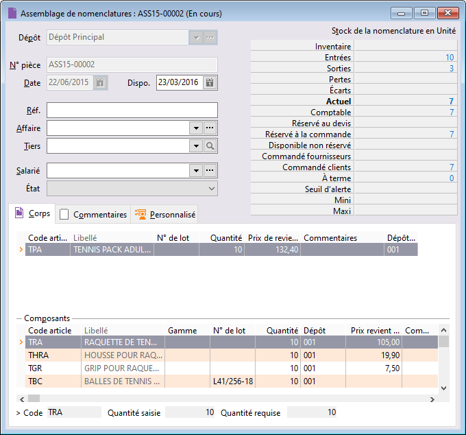

# Assemblage de nomenclatures

La fiche d’assemblage permet d’assembler des composants ou de désassembler 
 une nomenclature gérée en stock.

 

 

## Création d’une fiche d’assemblage

La création d’une fiche d’assemblage passe par la commande "Nouveau 
 document de stock" + "Fiche d’assemblage" du menu Stock.

 

Une nouvelle fiche peut également être créée à partir de la commande 
 "Documents de stock" du menu "Stock".

 

Lorsque vous enregistrez un assemblage, le logiciel génère tous les 
 mouvements correspondants : pour un assemblage, le logiciel augmente les 
 entrées en stock de la nomenclature et les sorties des composants. Pour 
 un désassemblage, le logiciel augmente les sorties en stock de la nomenclature 
 et augmente les entrées des composants.

 

Un assemblage peut ou non être valorisé. Le logiciel met à jour la valeur 
 de votre stock en prenant en compte soit le prix de revient de votre article, 
 soit le prix d’achat saisi en entrée.

## Exemple

## Définition de la fiche

L’entête de la fiche d’assemblage comporte obligatoirement une date 
 d’assemblage / désassemblage, un dépôt destination et éventuellement une 
 référence ainsi que le salarié responsable de cette opération.

### Choix du dépôt destination

C’est le dépôt dans lequel les mouvements d’entrées des nomenclatures 
 (pour un assemblage) et les mouvements de sortie (pour un désassemblage), 
 vont être comptabilisés.

### Salarié

Permet le suivi qualité et la traçabilité de l’article assemblé.

### Disponibilité

Ce champ Date de disponibilité théorique vous permettra d’affecter une 
 date à vos fiches d’assemblage pour mieux gérer vos délais de fabrication.

### État

Champ proposant une liste déroulante issu des Tables de référence/Assemblages/États. 
 Les états disponibles sont : " A réaliser ", " En cours 
 ", " Terminé ". Vous pouvez créer librement les états qui 
 correspondent mieux à votre gestion pour le suivi de vos documents.

### Référence

### Affaire

## Grille de nomenclature composée

La grille de nomenclature permet d’enregistrer toutes les nomenclatures 
 gérées en stock que vous souhaitez assembler ou désassembler. La ligne 
 de nomenclature est composée d’une référence article, d’un libellé, d’une 
 quantité, d’un prix unitaire, du dépôt des composants et éventuellement 
 d’un libellé de mouvement.

 

Consulter le détail de la grille cliquer [ici](Nomenclatures.md).

## Grille des composants

La grille des composants reprend automatiquement les composants définis 
 dans la fiche de la nomenclature courante. Le logiciel calcule la disponibilité 
 de chaque composant dans le dépôt précisé sur la ligne de la nomenclature.

 

Consulter le détail de la grille cliquer [ici](Composants.md).

## Visualisation du stock de la nomenclature et des composants

A droite de l’entête de la fiche, vous visualisez le stock de l’article 
 nomemclaturé lorsque vous êtes sur sa grille (Stock Nomenc. En Unité) 
 ou celui des composants lorsque vous êtes sur la ligne du composant (Stock 
 Compos. En Unité)

## Visualisation de la définition du composant

Cette visualisation est représenté sur une ligne contenant :

* Le code de l’article 
 de référence,
* La quantité requise 
 (inscrite dans l’onglet nomenclature de la fiche article),
* La quantité saisie.

 

Lorsque la quantité saisie est inférieure ou supérieure à celle requise, 
 celle-ci est de couleur Rouge et vous ne pourrez pas valider votre fiche 
 d’assemblage.

## Pied de document

Une zone commentaire vous permet de saisir du texte, des informations 
 complémentaires concernant le document.

## Suivi assemblage / désassemblage

Tous les mouvements générés par la fiche d’assemblage mettent à jour 
 la fiche du ou des dépôt(s), la fiche des nomenclatures et des composants 
 (onglet Stock). Ils sont consultables en "[Consultation 
 des mouvements](../../../Mouvements/1/MouvementsStock.md)".

