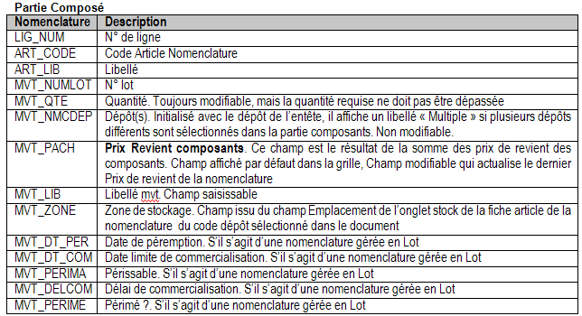

# Nomenclatures

La grille de nomenclature permet d’enregistrer toutes les nomenclatures 
 gérées en stock que vous souhaitez assembler ou désassembler.

 

La ligne de nomenclature est composée d’une référence article, d’un 
 libellé, d’une quantité, d’un prix unitaire, du dépôt des composants et 
 éventuellement d’un libellé de mouvement.

## Article

Seules les nomenclatures gérées en stock sont proposées. Voir [Saisie 
 des articles](../SaisieArticlePieceStock.md).

## Numéro de lot

Pour les articles de type nomenclature gérant 
 le stock et les numéros de lot, vous avez la possibilité de saisir un 
 numéro de lot.

## Numéro de série

Pour les articles sérialisés, il est nécessaire 
 de préciser le numéro de série de l’article par le menu contextuel "numéros 
 de série. . .".

 

Si toutefois, vous n’avez pas affecté de numéros de série lors de l’enregistrement 
 de la pièce, la fenêtre d’affectation des numéros de série s’ouvrira automatiquement.

## Quantité

La quantité est soit positive (pour un assemblage), soit négative (pour 
 un désassemblage).

## Dépôt des composants

Le logiciel propose automatiquement le dépôt principal (défini dans 
 les préférences du dossier). Indiquez le dépôt dans lequel vous souhaitez 
 comptabiliser les mouvements de 
 sortie des composants (pour un 
 assemblage) et d’entrée des composants 
 (pour un désassemblage). Si les composants sont répartis sur des dépôts 
 différents, le dépôt affiché dans ce champ sera le libellé "Multiple".

## Modification et informations disponibles pour les lignes saisies

A partir du menu contextuel ou des raccourcis clavier, plusieurs options 
 vous sont proposées :

* Ajouter une ligne 
 (Ins),
* Supprimer une ligne 
 (Ctrl + Suppr),
* Consulter le stock 
 de l'article nomenclature ainsi que ses équivalences (CTRL+E),
* Ouvrir automatiquement 
 la fenêtre de consultation du stock de l'article pour affecter le 
 numéro de lot et gamme de l’article de type nomenclature,
* Ouvrir la fenêtre 
 d'affectation des numéro de série,
* Passer à la grille 
 des composants de la nomenclature (CTRL+W),
* Ouvrir la fiche 
 de l'article (Ctrl+C),
* Avoir l'historique 
 de l’article : historique des documents réalisés pour cet article 
 (Ctrl+H),
* Imprimer la fiche 
 d’assemblage (Ctrl+P).

## Paramétrer les propriétés de la liste de saisie (Alt + entrée)

