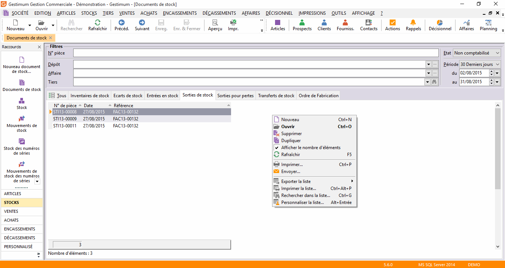

# Recherche dans la liste des documents de stock

 

## Numéro de pièce

Permet de rechercher une pièce précise. Saisissez 
 exactement son numéro en respectant l’espacement 
 entre préfixe et chiffres.

## Dépôt

Permet de rechercher les pièces pour un 
 dépôt précis.

## Affaire

Permet de rechercher les pièces pour une affaire 
 précise.

## État

Permet de rechercher les pièces en sélectionnant un type dans la liste 
 déroulante.

 

Le type "En cours" 
 regroupe tous les documents non imprimés.

Le type "Imprimés" 
 regroupe tous les documents imprimés.

Le type "Reliquat" 
 correspond aux [commandes 
 clients](../../../Ventes/Documents/TransfertDuplicationDocument/2/TransfertPartielDocumentVente.md) /commandes fournisseurs traitées partiellement.

Le type "Non comptabilisé" 
 regroupe les documents courants, imprimés et en reliquat.

Le type "Comptabilisés" 
 regroupe les factures et avoirs de ventes ou d'achats transférées en comptabilité.

Le type "Archivés" 
 regroupe les documents extraits d'un [fichier 
 d'archive](../../../ArchivageDocumentsAchatVenteStock/1/Archivage.md). Ces documents ne peuvent être modifiés.

Le type "Supprimés" 
 regroupe les documents qui ont été transférés et qui n'apparaissent donc 
 plus dans la liste par défaut "Non comptabilisés". Ils restent 
 consultables bien que grisés. L'opération [d'archivage](../../../ArchivageDocumentsAchatVenteStock/1/Archivage.md) 
 s'applique uniquement sur les documents dans l'état "Comptabilisés" 
 et "Supprimés". Seule l'opération de [purge](../../../ArchivageDocumentsAchatVenteStock/3/Purge.md) 
 permettra de supprimer définitivement de la base les pièces en état "supprimés".

## Périodes

Le logiciel propose toujours la dernière 
 période sur laquelle vous avez travaillée. La liste déroulante vous permet 
 de choisir une autre période : aujourd’hui, 
 hier, les 30 derniers jours, un mois, une année.

 

Pour définir une période particulière, de date à date, sélectionnez 
 Personnalisée et/ou saisissez directement le premier et dernier jour de 
 la période. L’icône  
 situé après la date ouvre le calendrier, vous pouvez ainsi sélectionner 
 plus facilement votre période.

## Liste

L’onglet Tous affiche tous les documents, les autres onglets affichent 
 la liste d’un type particulier de documents. Ces documents répondent aux 
 critères définis dans l'entête de la liste.

 

La raison sociale affichée correspond à celle du tiers payeur/acheteur.

 

La devise est celle de facturation et le montant est le montant facturé 
 dans cette devise.

 

Un double-clic sur un document permet d’ouvrir le document pour le modifier 
 ou le consulter. Lorsque les zones du document sont grisées et qu’un dièse 
 apparaît dans la barre de titre du document, cela signifie que le document 
 n’est plus modifiable.

 

Le menu contextuel donne accès à toutes les opérations de base, donne 
 la possibilité d'[archiver](../../../ArchivageDocumentsAchatVenteStock/1/Archivage.md) 
 les documents en état «supprimés» et permet d’accéder 
 aux fonctions générales d'une grille.

 

