# Inventaire de A à Z

                                  

Avant l’étape de validation de votre inventaire, pensez à faire une 
 **"Sauvegarde".**

## Préparer son inventaire

Tout d'abord, il faut aller dans STOCKS 
 | Préparer l’inventaire.

 

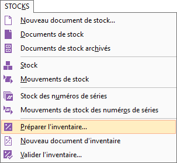 
  
Puis il faut définir le dépôt, le "dépôt 
 d’inventaire", "la date de l’inventaire" et "le type 
 d’inventaire".

**Attention, 
 la date d’inventaire est importante, après validation de l’inventaire 
 complet il ne sera plus possible de faire des mouvements de stock à une 
 date antérieure.**

 

L’inventaire Complet 
 traite la totalité de vos articles en une préparation d’inventaire unique. 
 Pour un inventaire Complet, la 
 validation génère un mouvement d’inventaire de type Comptabilisés, consultable 
 à partir de la commande "Mouvements de stock" du menu STOCKS 
 et met à jour le stock Inventaire. Le logiciel met également à jour les 
 lignes de mouvements dans la fiche des articles et du dépôt.

 

L’inventaire Tournant 
 consiste à inventorier vos articles plusieurs fois dans l’année pour suivre 
 au plus près certains articles. L’inventaire Tournant 
 ne supprime pas les mouvements d’entrées/sorties antérieurs. Pour un inventaire 
 Tournant, le logiciel génère une 
 pièce d’écart de stock dans laquelle il enregistre tous les écarts constatés 
 entre le stock Actuel et le stock inventorié.

 

La réalisation d’un premier inventaire tournant 
 est possible uniquement si vous avez réalisé un inventaire complet précédemment.

 

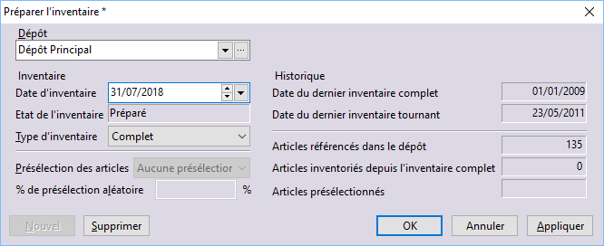

## Le document d’inventaire

Il faut aller dans STOCKS 
 | Nouveau document d’inventaire.

 

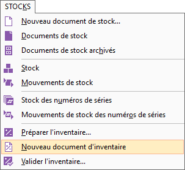

 

Vous saisissez votre dépôt en haut à gauche.

 

Puis trois options s’offrent à vous pour 
 la saisie de vos lignes d’inventaire :

1. * La **génération** des lignes 
	 automatiquement
	* L’**importation** des articles 
	 depuis un fichier txt ou csv
	* La **saisie manuelle** des 
	 lignes d’inventaires

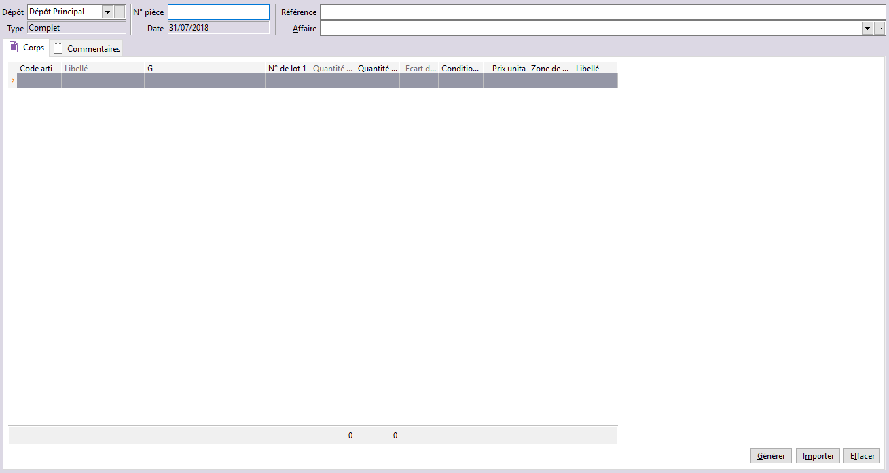

 

Si vous choisissez "Générer" la fenêtre 
 suivante apparaîtra : il vous suffira de cliquer en haut à droite 
 sur le bouton "Générer".

 

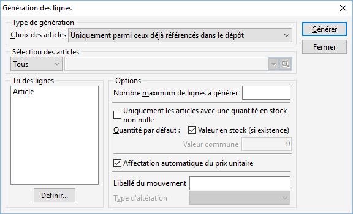

 

Une fois l’option choisie, la liste de vos articles 
 sera générée et vous devrez remplir la colonne "Quantité inventoriée" 
 afin de mettre vos quantités de stock.

 

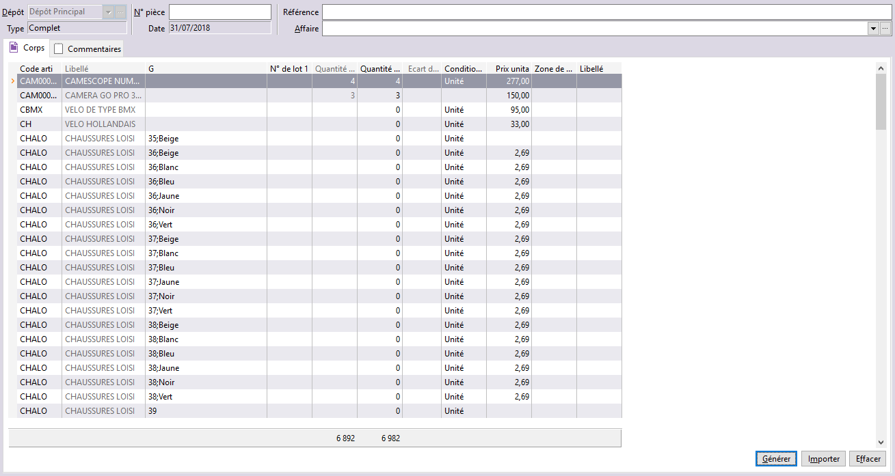

 

Une fois enregistré, vous pouvez retourner sur 
 votre inventaire pour faire des modifications, si nécessaire, en passant 
 par "Stocks/Documents de stock – onglet inventaires de stock".

 

**Pour les articles n’étant pas dans le document d’inventaire, les 
 stocks seront automatiquement remis à zéro lors de la validation de votre 
 inventaire**. Si vous ne souhaitez pas remettre l’article à zéro, insérez-le 
 dans votre document tout en laissant la quantité inventoriée égal à la 
 quantité stock.

## La validation de l’inventaire

*   Allez 
 dans STOCKS | Valider l'inventaire 
 :

 

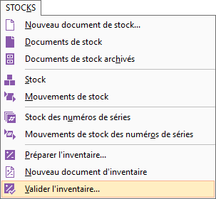 
  
La validation de l’inventaire consiste à prendre 
 en compte toutes les pièces d’inventaire enregistrées et à effectuer la 
 mise à jour effective du stock Actuel de chacun des articles référencés 
 dans l’inventaire.

 

Important !  Après validation tous les 
 documents BL, BR, Facture et Avoir de ventes ou d’achats réalisés avant 
 la date de l’inventaire ne seront plus modifiables. Ces documents ne seront 
 plus transférables à une date antérieure à l’inventaire.

 

Lors du traitement de la valorisation de l’inventaire, 
 vous obtenez un rapport listant les documents non comptabilisés et qui 
 bloquent le traitement.

 

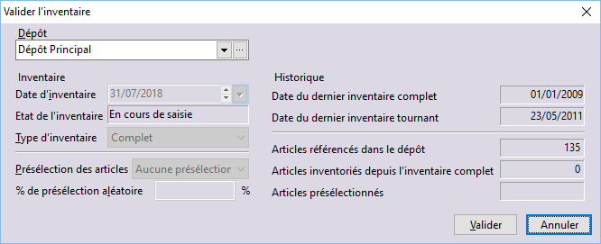

## L’impression des documents de stocks

Il est possible d’imprimer ou d’exporter 
 le document d’inventaire "Écart de stock" dans  le 
 chemin suivant : IMPRESSIONS | Stocks/Écart 
 de stock – Inventaire.

 

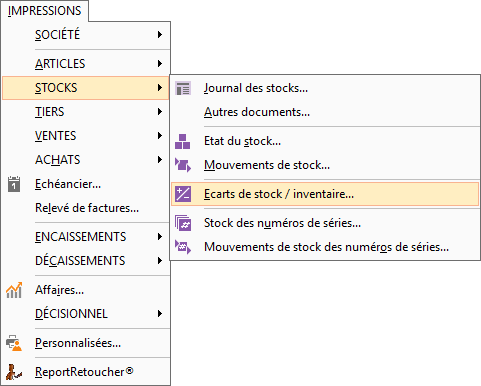

 

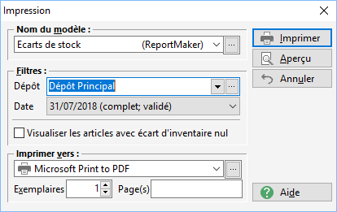

 

Après la validation, veuillez lancer un recalcul 
 du stock en passant par OUTILS | Recalculer/Stock.

 

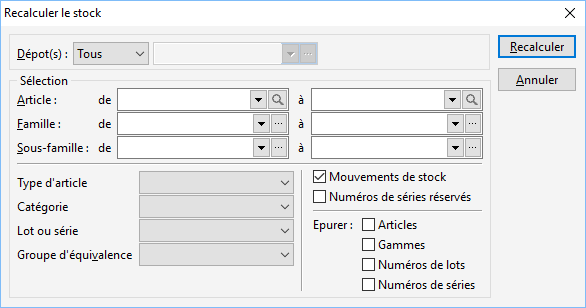     

## L’import d'inventaire

Vous trouverez ci-dessous la procédure d’importation d’inventaire complet 
 vous permettant d’importer vos stocks à partir d’un fichier texte (.txt) 
 ou excel (.csv).

 

Ce fichier doit obligatoirement contenir le code article (ART\_CODE) 
 ainsi que la quantité inventoriée (INV\_QTE), vous pouvez également y renseigner 
 le prix de revient unitaire (INV\_PACH), si cette information n’est pas 
 présente dans le fichier, Gestimum n’apportera pas de modification au 
 prix de revient actuel.

 

Si vous utilisez les lots vous devez indiquer le numéro de lot dans 
 le champ INV\_NUMLOT.

Si vous utilisez les gammes vous devez indiquer la gamme dans le champ 
 ART\_GAMME.

 

Il est conseillé de mettre sur la première ligne du fichier le nom des 
 champs pour automatiser les liaisons.

### Préparer son inventaire

L’étape une est identique à celle indiquée ci-dessus.

### Le document d’inventaire

Il faut créer un nouveau document d’inventaire 
 à partir du menu "Stocks/Nouveau document d’inventaire".

 

Dans ce document, cliquez en bas à droite sur 
 "Importer".

 

 

Ensuite vous devez sélectionner le fichier à 
 importer sur votre ordinateur, puis cliquez sur "Ouvrir" et 
 confirmer l'importation.

 

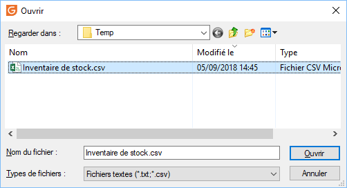

 

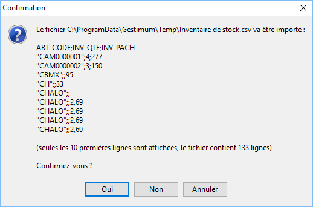

 

Les lignes d’inventaire sont alors importées 
 dans votre document d’inventaire Gestimum :

 

 

La quantité stock est reprise de Gestimum, et permet au logiciel de 
 calculer la Quantité écart.

 

Vous pouvez alors enregistrer le document, il sera ensuite disponible 
 dans le menu Stocks / Documents de stock / Onglet inventaire.

 

Vous pouvez ainsi revenir sur le document pour 
 y apporter des modifications, ou réaliser l’importation en plusieurs fois 
 (exemple : un fichier par famille d’article, …).

 

Il est important que chaque article soit présent 
 une seule fois dans le document, sinon les quantités seront cumulées lors 
 de la validation.

 

Les documents d’inventaire sont limités à 5 
 000 lignes, dans ce cas, vous pouvez vous appuyer sur plusieurs documents.

### Valider l’inventaire

Après avoir importé vos articles et vérifié 
 les informations, vous pouvez valider l’inventaire après avoir réalisé 
 une sauvegarde de la base de données.

 

Pour la validation, passer par le menu STOCKS | Valider l'inventaire.

 

## POINTS IMPORTANTS DES ÉTAPES D’INVENTAIRE

Il est recommandé d’être seul 
 connecté lors de la validation de l’inventaire.

 

Il est recommandé de faire une sauvegarde 
 avant la validation de votre inventaire.

 

La date d’inventaire est également importante, 
 après validation de l’inventaire complet il ne sera plus possible de faire 
 des mouvements de stock à une date antérieure (ici aucun document avant 
 le 31/12/2014) ni de modifier les documents existants jusqu’à cette date.

 

Après l'inventaire, il faut penser à [mettre 
 à jour les quantités des articles sérialisés](../5/InventaireArticlesSerialises.md).

