# Numéros de lots de A à Z

Avec Gestimum ERP il possible de gérer vos articles en lot.

## Paramétrages

Il faut aller dans "ARTICLES/Articles"

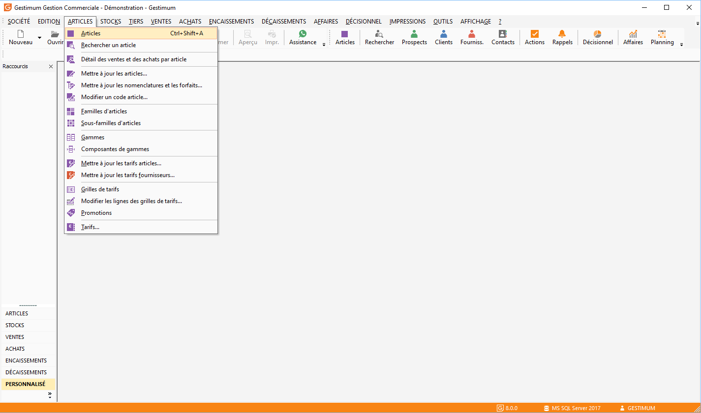
 

Dans la fiche article allez dans l’onglet "Stock" 
 puis dans "Mode de gestion" choisissez "Lot".

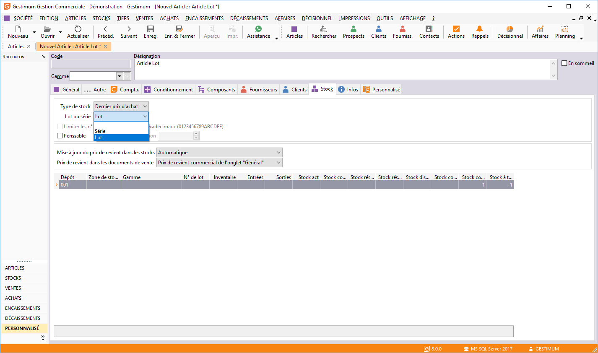
## Création du numéro de lot

Il faut d'abord créer un nouveau bon de commande 
 "ACHATS/Nouveau document d’achat".

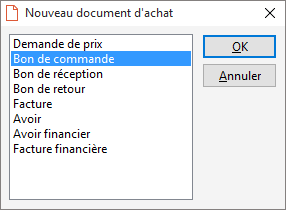
 

Ensuite vous sélectionnez un fournisseur puis 
 prendre l’article souhaité et enfin "Enregistrer". Vous pouvez 
 remplir dès à présent le numéro de lot (en faisant la touche F3) si vous 
 connaissez déjà le numéro que vus allez réceptionner. Dans le cas présenté, 
 nous allons créer le numéro de lot lors de l’étape suivante.

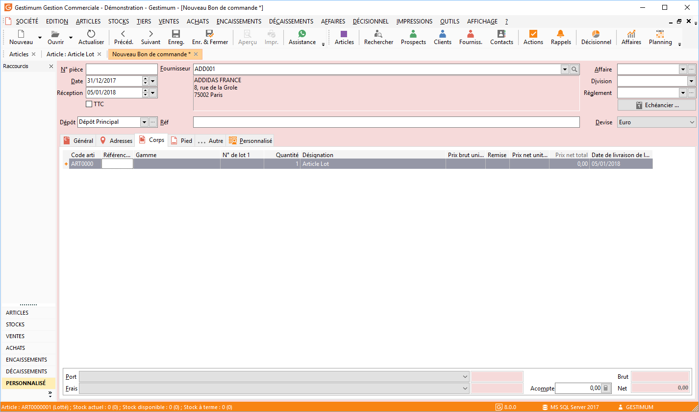
 

Vous pouvez ensuite transférer à partir de la 
 liste des documents d’achat le "Bon de commande" en "Bon 
 de réception" en faisant un clique droit "Transférer" sur 
 la commande.

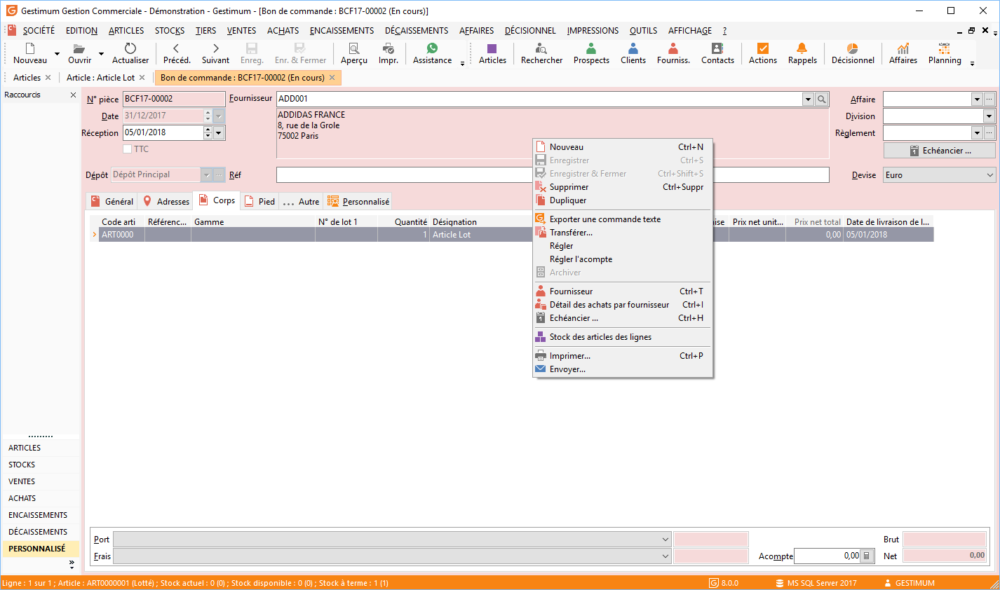
 

Une fenêtre s’ouvre afin de transférer ce document. 
 N’oubliez pas de cocher en bas "Sélectionner manuellement" le 
 bouton "N° de lot" puis faites "OK" en haut à droite.

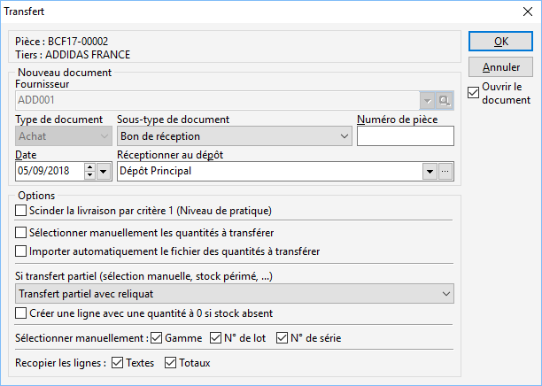
 

Une fois cliqué sur "OK" une nouvelle 
 fenêtre s’ouvre avec deux choix Si un "numéro de lot" existe 
 déjà, il vous sera proposé dans la liste des numéros de lot disponible. 
 Si le "numéro de lot" n’existe pas cliquez en bas sur "Nouveau" 
 afin de créer une nouvelle référence en renseignant son nom et sa date 
 de péremption.

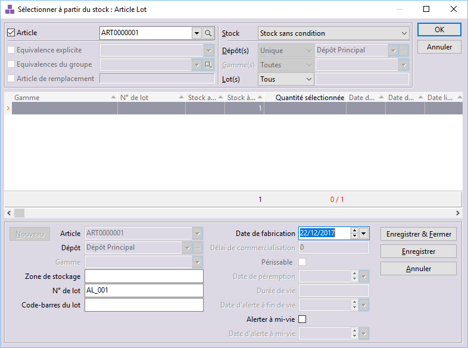 
  
Une fois enregistré votre "Bon de réception" 
 apparaît avec le numéro de lot créé.

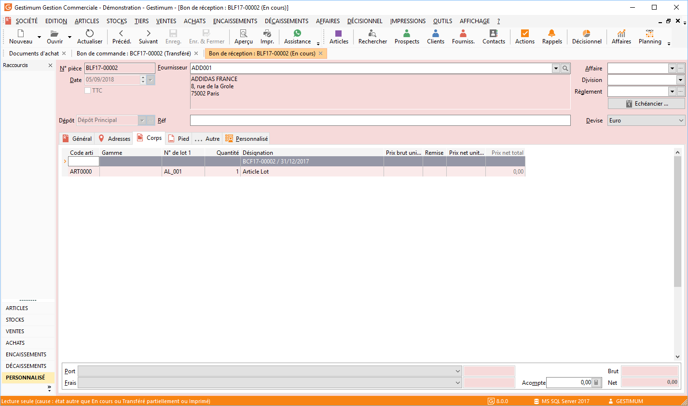
## Visualisation des numéros de lot disponible

Pour visualiser les numéros de lot existant 
 sur un article allez dans votre article puis dans l’onglet "Stock".

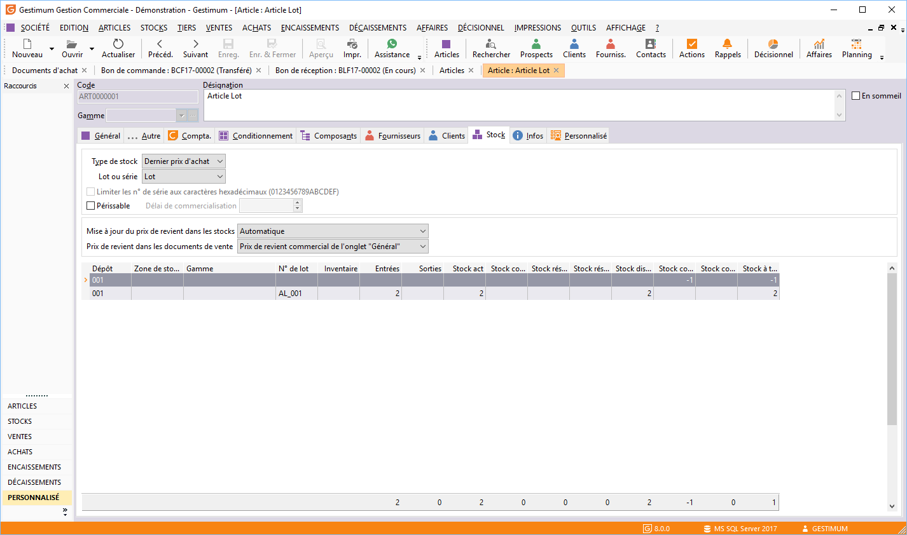
 

Vous pouvez aussi aller dans "STOCKS/Mouvements 
 de stock".

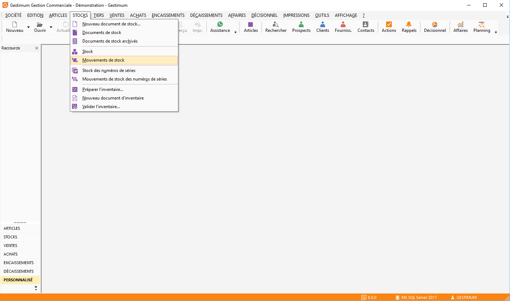
 

Vous choisissez votre article et cliquez sur 
 "Rechercher".

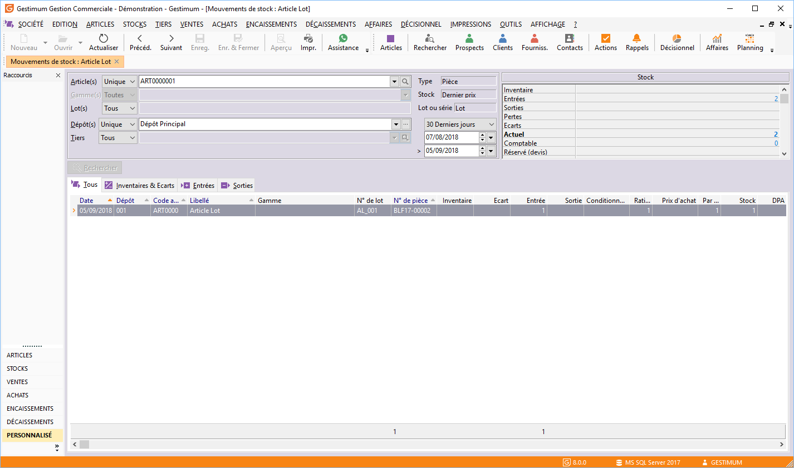
