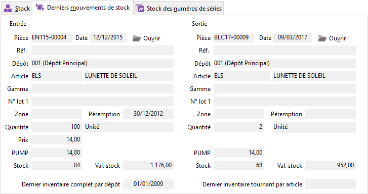

# Derniers mouvements de stock

Il affiche les informations concernant le dernier mouvement d’entrée 
 et le dernier mouvement de sortie pour le dépôt.

 

Lors que vous demandez la [consultation de stock 
 pour un article unique](Stock.md), les mouvements affichés sont ceux de cet article.

 

 

La pièce correspondante au mouvement peut être consultée directement 
 par le bouton Pièce.

 

Par le menu contextuel, vous pouvez :

* Imprimer
* Rafraîchir
* Activer la [recherche 
 automatique](../1-3/RechercheAutomatiqueStock.md)

