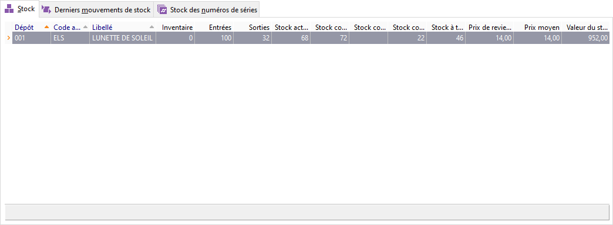

# Stock

 

A partir de l’état de stock en cours, double-cliquez sur la ligne de 
 l’article pour obtenir la "[Consultation 
 des mouvements](../../Mouvements/1/MouvementsStock.md)".

 

Cette option est également disponible à partir du menu contextuel.

 

Pour les articles gérants [les 
 numéros de lot](../../NumerosLots/2/Numéros_de_lots_de_A_à_Z.md) et [les 
 gammes](../../../Articles/Gammes/2/Gamme/Gamme.md) les colonnes du même nom sont renseignées.

 

Lorsque vous gérez les articles [périssables](../../NumerosLots/Trier/ArticlePerissable.md), vous disposez dans 
 les propriétés de la grille de plusieurs champs spécifiques.

 

Lorsque le mot Multiple apparaît dans les colonnes Dépôt, N° de Lot 
 et/ou Gammes, cela signifie que les quantités représentent un total tous 
 dépôts, numéros de lot et gammes confondues. Le [bouton 
 Décomposer](../1-3/OptionsDecompositionStock.md) permet de demander un détail.

 

Lorsque le terme N/S apparaît dans les colonnes Seuil d’alerte, Stock 
 Mini et/ou Stock Maxi, cela indique que [la 
 décomposition des dépôts](../1-3/OptionsDecompositionStock.md) n’est pas sélectionnée et par conséquent 
 les chiffres sont non significatifs.

 

Le menu contextuel de cette grille permet de :

* voir la liste des 
 mouvements de stock
* imprimer
* rafraîchir
* activer la recherche 
 automatique
* accéder aux fonctions 
 générales des grilles

