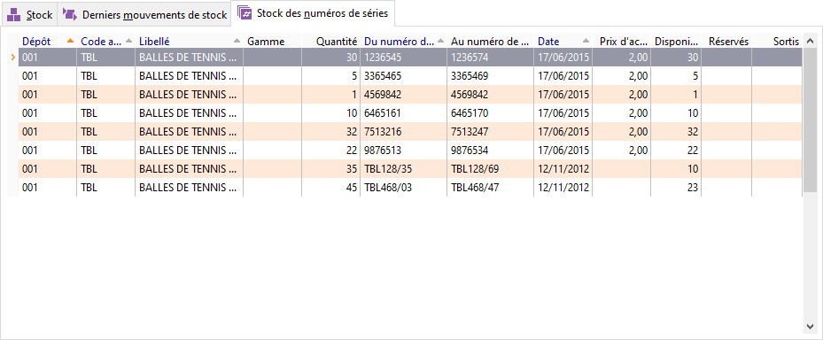

# Stock des numéros de séries

En consultation d’un article unique gérant les numéros de Série, apparaît 
 ici le détail des séries avec leur état : Disponible, 
 Sortis ou Réservés.

 

 

Un double-clic sur une ligne de série affiche les mouvements des numéros 
 de série. Vous pouvez accéder à cette fenêtre par le menu contextuel ou 
 le raccourci clavier Ctrl + O.

 

Ce menu vous permet également de consulter les numéros encore disponibles 
 ainsi que le raccourci Ctrl + D.

 

Ce menu vous permet également :

* D’imprimer,
* De rafraîchir,
* D’activer la recherche 
 automatique,
* D’accéder aux fonctions 
 générales des grilles.

