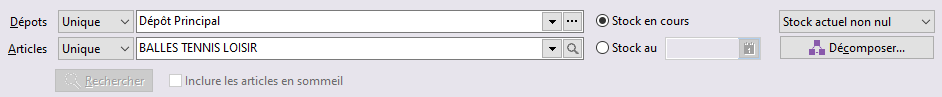

# Stock

La "Consultation du stock" permet d’obtenir le détail des 
 quantités en stock pour une sélection d’articles donnée, pour un ou plusieurs 
 dépôts, les informations du dernier mouvement d’entrées et de sorties, 
 ainsi que les intervalles de numéros de série pour les articles sérialisés.

## Entête

### Dépôts

[L’état de stock](OngletStock.md) peut être demandé sur 
 :

* Un dépôt (Unique)
* Plusieurs dépôt 
 à sélectionner (Ensemble)
* Sur la totalité 
 des dépôts (Tous)

 

Si vous avez demandé un état de stock sur plusieurs dépôts ou tous les 
 dépôts, il est possible de [décomposer 
 cet état](../1-3/OptionsDecompositionStock.md) (bouton Décomposer).

### Article(s) à consulter

L’état de stock peut être demandé pour un article précis (Unique), 
 pour une [sélection 
 d'articles](../../Trier/ZoneSelectionUnPlusieursArticles.md) (Avancée) ou pour 
 la totalité des articles (Tous).

### Période de consultation du stock

Il est possible de consulter le stock en cours ou le stock à une date 
 donnée avec ou non prise en compte des articles dont la quantité en stock 
 est égale à zéro.

 

Le stock en cours affiche les quantités pour 
 chacun des états de stock suivi par le logiciel: stock d’inventaire, entrées, 
 sorties, stock réel, stock comptable, S.A.V. , Stock théorique, perte, 
 seuil d’alerte, stock mini, stock maxi, commandes fournisseurs, commandes 
 clients.

 

Le stock à une date donnée affiche pour chaque 
 article, le prix moyen, le prix unitaire, la quantité, la valeur du stock, 
 le type de stock de l’article, les informations sur le dernier mouvement 
 de stock, la famille, la sous-famille, le type de stock.

 

Il est possible de détailler les lignes de stock 
 à l’aide 
 du bouton [Décomposer](../1-3/OptionsDecompositionStock.md).

## Onglets

Vous disposer des onglets suivants pour visualiser votre stock :

* [Stock](OngletStock.md)
* [Dernier 
 mouvements de stock](OngletDerniersMouvementsStock.md)
* [Stock 
 des numéros de séries](OngletStockNumerosSeries.md)

 

Dans le menu contextuel de chaque grille, vous pouvez :

* Imprimer
* Rafraîchir
* Activer la recherche 
 automatique

