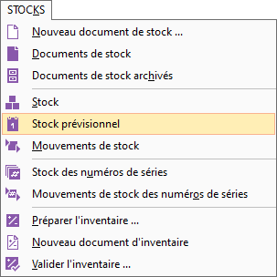
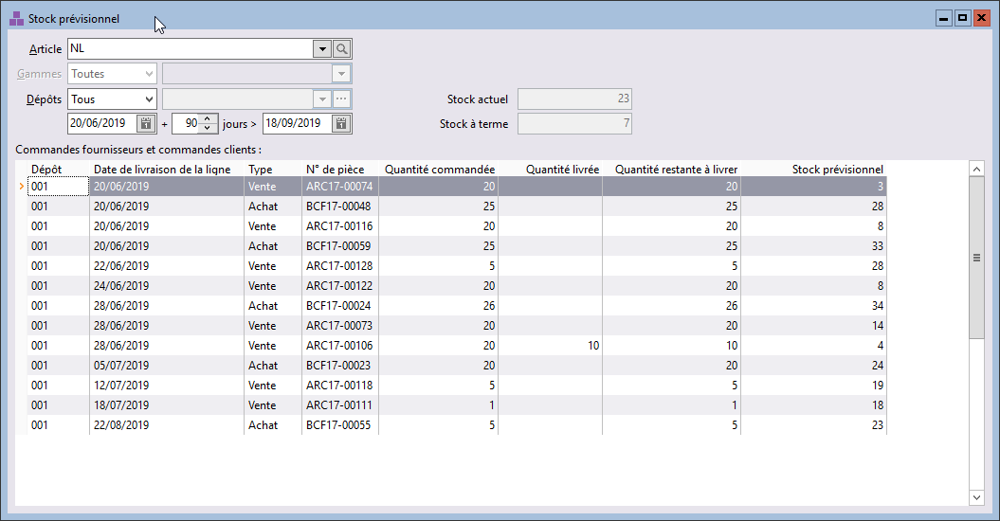

# Stock prévisionnel

Un sous-menu STOCKS | Stock prévisionnel 
 a été ajouté.

 

## Fenêtre

La fenêtre est identique à celle accessible depuis la saisie de commandes 
 clients.

 

Seuls les zones "Article" et "Gamme" changent de 
 mode de fonctionnement, les autres zones gardent le même fonctionnement.

 

## Options

L’entête de la fenêtre se compose de 4 zones de sélection :

* Article & Gammes : saisissables.
* Dépôts : permet de sélectionner, 
 un seul dépôt, un ensemble de dépôts ou tous les dépôts. Cette sélection 
 est mémorisée, poste par poste après une première activation.
* Dates : La date de début de la période 
 est la date du jour. Cette donnée n’est pas modifiable. La date de 
 fin sera la date du jour + 30 jours, modifiable et mémorisée, poste 
 par poste. Ici, il s’agit de sélectionner la période sur laquelle 
 on souhaite consulter les dates prévisionnelles de livraison.
* Stock actuel
* Stock à terme : calculé en fonction 
 de vos préférences de gestion.

## Résultat

Dans la partie tabulaire, sont affichées les lignes de commandes fournisseurs 
 et de commandes clients triées par date de livraison croissantes et numéro 
 interne.

 

Les colonnes suivantes sont disponibles dans la personnalisation de 
 la liste :

* Code tiers
* Date du document
* Date de livraison de la ligne de document
* Dépôt
* État du document
* Gamme
* Numéro de ligne
* Numéro de pièce
* Numéro interne de document
*  Quantité commandée
*  Quantité livrée
* Quantité restante à livrer
* Raison sociale
* Stock prévisionnel
* Type de document (achat ou vente)

 

La colonne stock prévisionnel part du stock actuel, auquel on ajoute 
 les quantités commandées chez les fournisseurs et soustrait les quantités 
 commandées chez les clients. Cette colonne vous présente le stock à terme 
 à une date précise.

## Restrictions

Les articles composés (Forfait, Nomenclature non gérée et Nomenclature 
 gérée) sont exclus de ce fonctionnement.

