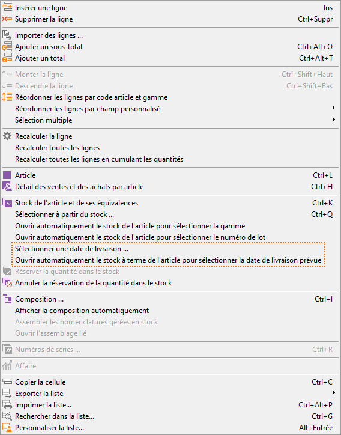
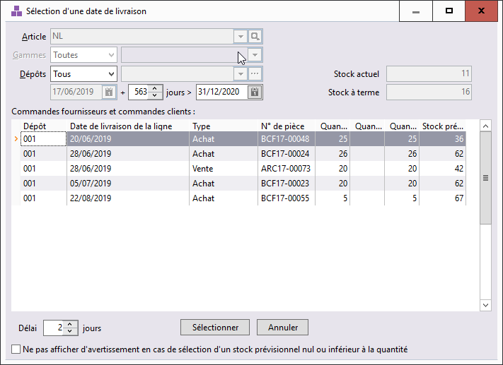
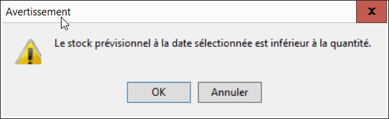
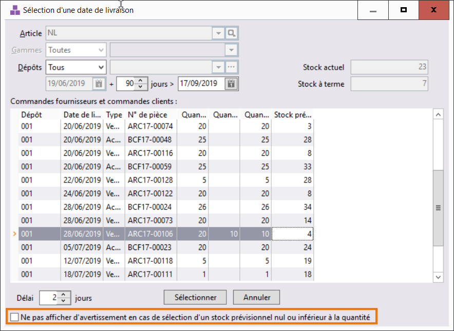

# Stock prévisionnel depuis une commande client

La fenêtre ["Stock prévisionnel"](../5-1/StockPrevisionnel.md) est aussi accessible depuis les commandes clients.

## Menu contextuel

Deux nouvelles fonctions sont désormais disponibles dans le menu contextuel d'une commande client :

 

### Sélectionner une date de livraison

Permet d'ouvrir manuellement la boite de dialogue de sélection d’une date de livraison.

### Ouvrir automatiquement le stock à terme de l’article pour sélectionner la date de livraison prévue

Permet d'activer l'ouverture automatique de la boite de dialogue lors de l'ajout ou de la modification de la quantité d’une ligne. Cette option est désactivée par défaut, mais mémorisée, poste par poste après une première activation.

## Fenêtre

L’activation d’une de ces 2 options, ouvre la boite de dialogue suivante :

 

## Options

L’entête de la fenêtre se compose de 4 zones de sélection :

* Article & Gammes : données non saisissables, reprises dans la ligne du document, à l’origine de l’ouverture de la fenêtre.
* Dépôts : permet de sélectionner, un seul dépôt, un ensemble de dépôts ou tous les dépôts. Cette sélection est mémorisée, poste par poste après une première activation.
* Dates : La date de début de la période est la date du jour. Cette donnée n’est pas modifiable. La date de fin sera la date du jour + 30 jours, modifiable et mémorisée, poste par poste. Ici, il s’agit de sélectionner la période sur laquelle on souhaite consulter les dates prévisionnelles de livraison.
* Stock actuel
* Stock à terme : calculé en fonction de vos préférences de gestion.

## Résultat

Dans la partie tabulaire, sont affichées les lignes de commandes fournisseurs et de commandes clients triées par date de livraison croissantes et numéro interne.

 

Les colonnes suivantes sont disponibles dans la personnalisation de la liste :

* Code tiers
* Date du document
* Date de livraison de la ligne de document
* Dépôt
* État du document
* Gamme
* Numéro de ligne
* Numéro de pièce
* Numéro interne de document
*  Quantité commandée
*  Quantité livrée
* Quantité restante à livrer
* Raison sociale
* Stock prévisionnel
* Type de document (achat ou vente)

 

La colonne stock prévisionnel part du stock actuel, auquel on ajoute les quantités commandées chez les fournisseurs et soustrait les quantités commandées chez les clients. Cette colonne vous présente le stock à terme à une date précise.

## Validation

La validation de cette boite de dialogue pourra se faire :

* Soit par double clic sur une ligne
* Soit par simple clic sur le bouton "Sélectionner"

 

Par défaut, la date de livraison sélectionnée sera recopiée dans la ligne de commande client. Une zone en bas de la fenêtre vous permet d’ajouter un délai en nombre de jours modifiable et mémorisé poste par poste, qui viendra s’ajouter à la date de livraison précédemment sélectionnée.

 

En cliquant sur le bouton annuler, c’est la date saisie par l’utilisateur dans le document (à la ligne ou en en-tête) qui sera conservée.

 

Lors de la validation de la boite de dialogue de sélection d’une date de livraison, un contrôle est fait entre la quantité saisie dans la ligne du document et le stock prévisionnel à la date de livraison sélectionnée.

 

Dans le cas d’un stock prévisionnel insuffisant, un message informatif s’ouvre pour alerter l’utilisateur.

 

 

Il s’agit d’un message informatif non bloquant.

 

En cliquant sur « OK », les fenêtres se fermeront et la date sélectionnée sera renseignée dans le document.

 

En cliquant sur « Annuler », l’utilisateur retournera dans la fenêtre de sélection d’une date de livraison.

 

Une case à cocher permet de désactiver l’ouverture de ce message.

 

La valeur de cette case à cocher est mémorisée, poste par poste.

 

## Restrictions

Les 2 nouveaux éléments de menu ne sont présents que dans les commandes clients.

 

La boite de dialogue ne s'ouvrira pas lors :

* d’un import de documents de vente via le menu principal
* d’un import en ligne de commande
* d’un import via le web service
* d'un import de lignes dans les documents de vente

 

Les articles composés (Forfait, Nomenclature non gérée et Nomenclature gérée) sont exclus de ce fonctionnement.

