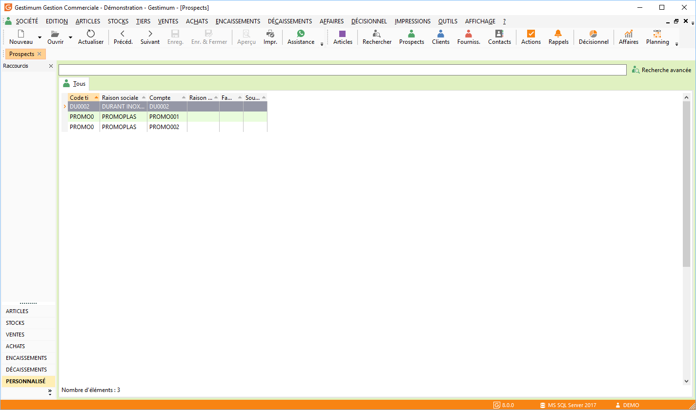

# Liste des prospects

Toutes les listes ont un fonctionnement commun.

 

La gestion des prospects (création, modification, suppression, impression) 
 s’effectue à partir de la barre d'outils, du menu contextuel ou des raccourcis 
 claviers.

 

## Recherche de prospects

Deux possibilités de recherche clients sont disponibles: la recherche 
 standard commune à toutes les grilles et la [recherche 
 plus poussée](../9/Recherche.md) accessible par le menu Édition ou par clic dans la zone 
 Rechercher puis la combinaison de touches Ctrl 
 + F.

 

Toutefois par le menu contextuel de la liste des prospects, vous pouvez 
 :

* Afficher ou non 
 les prospects en sommeil,
* Transformer… le 
 prospect en client.

## Opérations disponibles à partir de la liste des prospects

Pour chaque prospect de la liste, le menu contextuel (clic droit) permet 
 d’accéder :

* A la création d’une 
 nouvelle fiche,
* A l’ouverture d'une 
 fiche,
* A l’affichage ou 
 non des prospects en sommeil,
* A la suppression 
 d’une fiche,
* A la duplication 
 de la fiche ,
* A la recherche 
 d'une fiche,
* A la transformation 
 d'un prospect en client,
* A la création d’un 
 nouveau document à son attention,
* A la liste des 
 documents réalisés pour ce client,
* A l’historique 
 du client,
* A la consultation 
 des tarifs du client,
* A l’Impression 
 ou aperçu des étiquettes et de statistiques,
* Au rafraîchissement 
 de la fiche,
* Aux fonctions générales 
 d'une grille.

