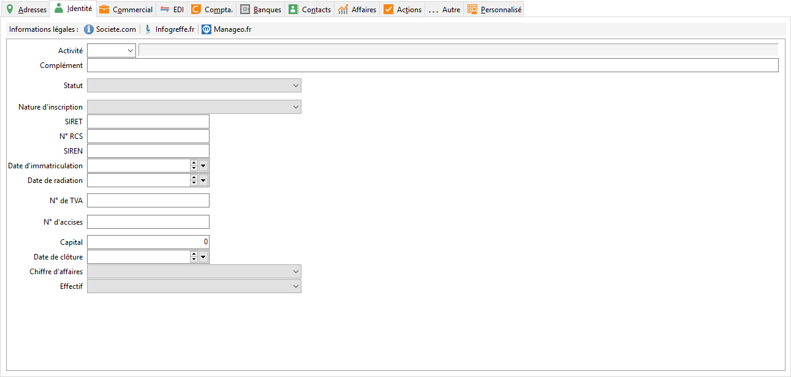

# Identité

Certaines de ces informations renseignées dans cet onglet vous serviront 
 lors de la réalisation de documents fiscaux. (DEB, Bilan, Compte de résultat, 
 Export liasses fiscales txt, …) :

* Code activité (APE) 
 provenant des tables de référence,
* Complément au code 
 d'activité,
* Statut juridique 
 provenant des tables de référence,
* Nature d'inscription 
 provenant des tables de référence,
* Numéro de SIRET,
* Numéro RCS,
* Numéro SIREN,
* Date d'immatriculation,
* Date de radiation,
* Numéro de TVA : 
 Utilisé dans la déclaration de TVA,
* Numéro d'accises 
 : Utilisé dans la gestion des taxes sur les alcools,
* Capital,
* Date de clôture 
 comptable,
* Chiffre d'affaires,
* Effectif provenant 
 des tables de référence

 

