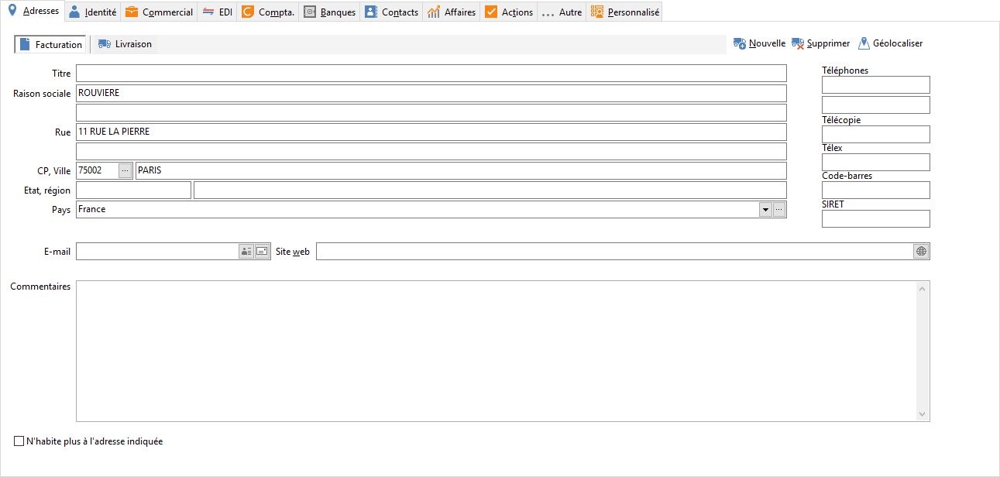

# Client

Chaque fiche client est composée d'une [entête](ClientEntete.md) 
 et des onglets suivants : [Adresses](ClientOngletAdresses.md), 
 [Identité](ClientOngletIdentite.md), [Commercial](ClientOngletCommercial.md), 
 [EDI](ClientOngletEDI.md), [Compta](ClientOngletCompta.md), 
 [Banques](ClientOngletBanques.md), [Contacts](ClientOngletContacts.md), 
 [Affaires](ClientOngletAffaires.md), [Actions](ClientOngletActions.md), 
 [Autre](ClientOngletInfos.md) et [Personnalisé](ClientOngletPersonnalise.md).

 

