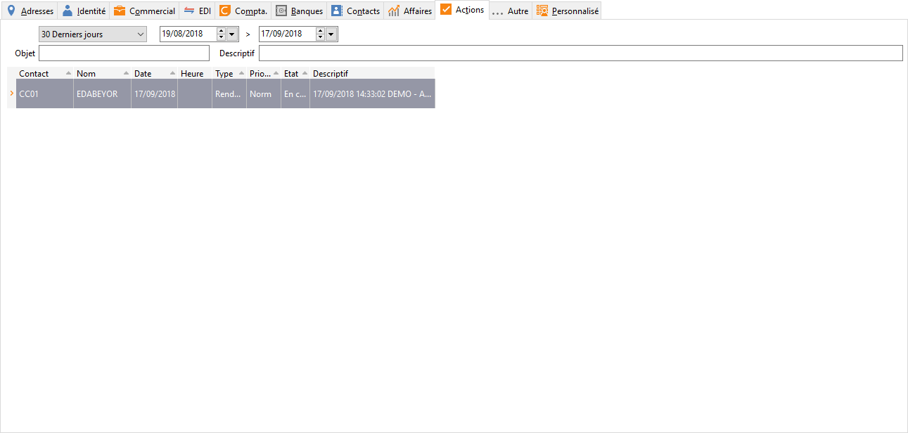

# Actions

Cet onglet affiche toutes les actions entreprises à l’attention de ce 
 tiers ou de tous les contacts rattachés au tiers.

 

 

Dans la fiche Client, cet onglet est renseigné automatiquement lors 
 de la réalisation des relances.

 

Le menu contextuel (clic droit) de cette grille vous permet :

* D’enregistrer 
 /ouvrir une nouvelle action,
* De supprimer 
 une action,
* De dupliquer 
 une action,
* D’accéder 
 à toutes les fonctions générales d'une grille.

