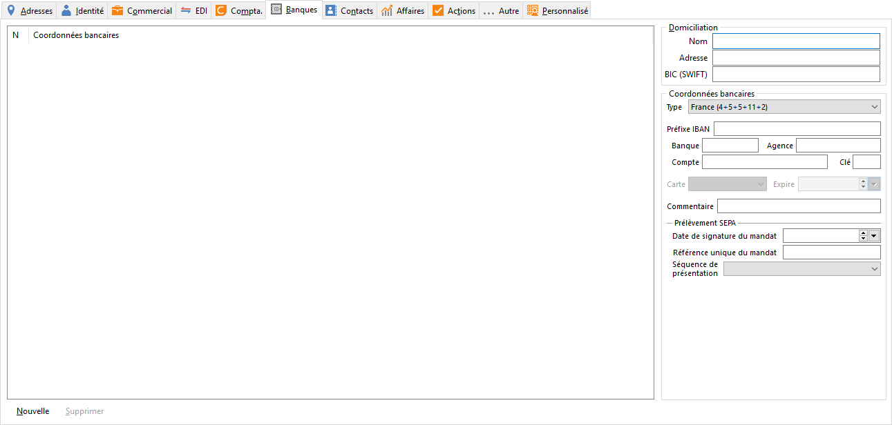

# Banques

Plusieurs comptes de banques peuvent être enregistrés pour un même tiers avec le bouton .

 

## Domiciliation

Saisir ici les coordonnées de la banque du compte (Nom, Adresse, Swift)

## Coordonnées bancaires

Plusieurs types de compte peuvent être renseignés.

 

Le type de coordonnée "Générique", vous permet de saisir un IBAN dans une zone unique, et peut recevoir jusqu'à 34 caractères.

 

Le type "Carte bancaire", rend accessible les zones "Carte" et "date d’expiration". Les catégories de carte bancaires sont à définir dans les tables de la société (Master Card, Visa, …).

 

| Type de coordonnées | Préfixe IBAN | Banque | Guichet | Compte | Clé |
|--------------------|--------------|--------|---------|--------|-----|
| Générique          |              |        |         | 34     |     |
| Allemagne          | 4            | 8      |         | 10     |     |
| Andorre            | 4            | 4      | 4       | 12     |     |
| Autriche           | 4            | 5      |         | 11     |     |
| Belgique           | 4            | 3      |         | 7      | 2   |
| Bulgarie           | 4            | 4      | 4       | 10     |     |
| Canada             | 4            | 4      | 5       | 11     |     |
| Carte Bancaire     | 4            |        |         | 20     |     |
| CCP                | 4            |        |         | 11     |     |
| Chypre             | 4            | 3      | 5       | 16     |     |
| Danemark           | 4            |        |         | 18     |     |
| Espagne            | 4            | 4      | 4       | 10     | 2   |
| Estonie            | 4            | 4      |         | 11     | 1   |
| États-Unis         | 4            |        |         | 21     |     |
| Finlande           | 4            | 6      |         | 7      | 1   |
| France             | 4            | 5      | 5       | 11     | 2   |
| Grande Bretagne    | 4            | 4      | 6       | 8      |     |
| Grèce              | 4            | 7      |         | 16     |     |
| Hongrie            | 4            | 3      | 4       | 15     | 2   |
| Irlande            | 4            | 6      |         | 8      |     |
| Italie             | 4            | 5      | 6       | 12     |     |
| Lettonie           | 4            | 4      |         | 13     |     |
| Lituanie           | 4            | 5      |         | 11     |     |
| Luxembourg         | 4            |        |         | 16     |     |
| Malte              | 4            | 5      |         | 18     |     |
| Maroc              | 4            | 3      | 3       | 16     | 2   |
| Norvège            | 4            | 4      |         | 6      |     |
| Pays-Bas           | 4            | 4      |         | 10     |     |
| Pologne            | 4            | 8      |         | 16     |     |
| Portugal           | 4            | 4      | 4       | 11     | 2   |
| République tchèque | 4            | 4      | 6       | 10     |     |
| Roumanie           | 4            | 4      |         | 16     |    

## Prélèvements SEPA

Vous avez la possibilité de générer des fichiers de prélèvements SEPA, cette zone vous permettra de renseigner :

* La date de signature du mandat
* La référence unique du mandat
* La séquence de présentation

