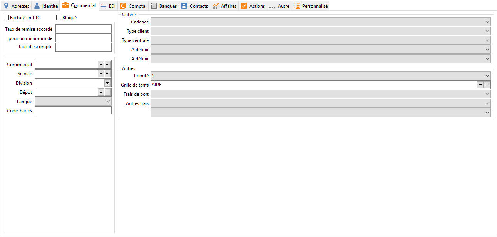

# Commercial

## Facture en ttc

Cette option sera initialisée à la création de la fiche Tiers avec l’option 
 paramétré dans les Préférences de gestion/ventes ou achat/HT.

 

Elle sera reprise dans les documents lors de la sélection du tiers.

## Bloque

Cette option permet de bloquer la saisi de tout document pour ce tiers.

 

Si le tiers a un tiers payeur associé, le contrôle 
 se fera sur le payeur.

 

Le contrôle est effectué également lors d'un 
 transfert de document.

## Remise et escompte sur facture

### Taux de Remise

La remise sera automatiquement appliquée en [pied 
 de document.](../../../Ventes/Documents/Fiche/4Pied/OngletPied.md)

 

Si vous renseignez en plus le ‘pour un minimum de‘, la remise sera accordée 
 si le montant HT est supérieur au montant minimum saisi.

### Taux de Escompte

Pour saisir un taux d’escompte, il faut obligatoirement en avoir renseigné 
 un dans les préférences de la société. Ce taux peut-être supérieur à celui 
 des préférences.

 

L’escompte sera automatiquement appliqué en [pied 
 de document](../../../Ventes/Documents/Fiche/4Pied/OngletPied.md)

 

Ils peuvent être définis au niveau de la [famille 
 ou sous-famille de tiers](../../7/ListeFamillesTiers.md).

### Affectations

### Commercial

Le commercial habituel sera automatiquement repris en création d’un 
 document et permettra le [calcul 
 des commissions](../../../Ventes/Commissions/2/Calcul.md).

### Service - Division

Service et division peuvent être définis au niveau de la [famille 
 ou sous-famille de tiers](../../7/ListeFamillesTiers.md).

 

Toutefois, si le représentant sélectionné est rattaché à un service 
 et une division, le client en hérite par défaut. Ces informations restent 
 toutefois modifiables.

### Dépôt

Le dépôt sera par défaut repris en création d’un document au lieu du 
 dépôt principal (défini dans les préférences du dossier).

### Langue

La langue du pays de facturation du client est automatiquement proposée 
 mais il est possible d’indiquer une autre langue. Elle sera automatiquement 
 reprise en réalisation d’un document (onglet Entête) et sert pour imprimer 
 des modèles de document particulier.

### Code Barre

Il correspond au champ PCF\_CBAR dans la base de données. Il est saisissable 
 sur 20 caractères et il est indispensable pour les échanges EDI qui gèrent 
 un contrôle sur ce champ.

## Critères spécifiques

Les cinq critères supplémentaires sont à définir dans les tables (Critères 
 sur tiers) de la société. Ce sont des informations complémentaires sur 
 les tiers mis à votre disposition pour répondre à des caractéristiques 
 tiers propres à votre activité commerciale.

## Autres

### Priorité

La priorité sert dans [l'affectation 
 des commandes clients](../../../Ventes/Documents/TransfertCommandesClients/2/SelectionCommandes.md). Elle peut être définie au niveau de la [famille 
 ou sous-famille de tiers](../../7/ListeFamillesTiers.md).

### Grille de tarif

La [grille 
 de tarif](../../../Articles/GrillesTarifsPromotions/1/Fiche.md) permet d’appliquer une tarification particulière à ce client. 
 La grille peut être définie au niveau de la [famille 
 ou sous-famille de tiers](../../7/ListeFamillesTiers.md).

### Port / Frais / Frais supplémentaire

Le port et les frais par défaut, défini dans les préférences sont automatiquement 
 proposé sur la fiche tiers en création.

 

Vous pouvez également visualiser et/ou créer les frais par les touches 
 F4 + F2 ou F4+Inser.

 

Lors de la réalisation d’un document, le port, les frais et les frais 
 supplémentaires du tiers seront automatiquement proposés en pied de document.

 

