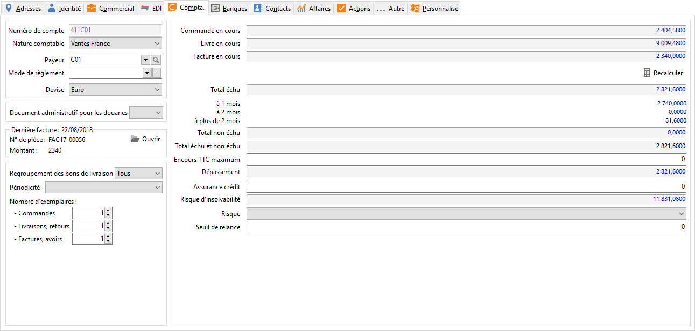

# Compta

## Paramétrage comptable

### Compte comptable

Le numéro de compte comptable (client et fournisseur) est généré automatiquement 
 mais reste modifiable en codification manuelle (voir les préférences)

### Nature comptable

A chaque client correspond une nature comptable de vente unique. Elle 
 peut être définie au niveau de la [famille 
 ou sous-famille de tiers](../../7/ListeFamillesTiers.md).

### Payeur

Lorsque le client n’est pas le payeur, vous devez indiquer ici le tiers 
 payeur. Lors de la réalisation d’un document, l’adresse de facturation 
 sera celle du tiers payeur et l’échéance de la pièce sera affectée à sa 
 fiche.

### Le mode de règlement

Le mode de règlement du client peut être défini dans la [sous-famille/famille 
 de tiers](../../7/ListeFamillesTiers.md) ou directement dans la fiche du tiers.

 

En réalisation de document, le mode de règlement du client sera exploité 
 pour générer des lignes d’échéances. Le type de règlement associé au mode 
 de règlement du tiers sera directement proposé en Réception des règlements 
 et servira ensuite en remise en banque.

### Devise

La devise associée au pays de facturation est automatiquement proposée. 
 Le client sera par défaut facturé en cette devise.

## Dernière facture

Le numéro et le montant de la dernière facture à l’attention du client 
 s’inscrivent ici. Le bouton permet d’ouvrir la pièce.

 

Vous pouvez mettre à jour ce champ par l’intermédiaire du "recalcul 
 des infos tiers" du menu Outils.

## Pièces

### Regroupement BL

Lors de [l'opération 
 de regroupement des bons de livraison](../../../Ventes/Documents/Regroupement/3/RegroupementMasseLivraisonsReceptions.md), le logiciel tient compte du 
 type choisi ici.

### Périodicité

Un regroupement de BL peut être limité au tiers appartenant à la même 
 périodicité de regroupement. Les périodicités sont à créer dans les tables 
 de la société.

### Nombre d’exemplaire

Ces informations seront automatiquement proposés en impression. Elles 
 peuvent être définies au niveau de la [famille 
 ou sous-famille de tiers](../../7/ListeFamillesTiers.md).

## Informations chiffrées de la fiche client

### Encours maximum

L’encours maximum indiqué dans les préférences s’inscrit par défaut 
 mais il est possible d’indiquer un montant d’encours particulier pour 
 ce client. En réalisation d’un document à l’attention d’un client dont 
 le montant d’encours dépasse le maximum, le logiciel fait apparaître le 
 champ de son nom en rouge.

* Commandé
* Livré
* Facturé
* Solde commercial
* Dépassement

### Solde au - Dépassement - Total non Échu - Total Échu

Ces montants sont automatiquement calculés en fonction des documents 
 réalisés. Un recalcul de ces montants peut-être demandé à partir du menu 
 Outils + Recalculs + Recalcul des infos tiers.

### Assurance Crédit

L’encours assuré indiqué dans les préférences s’inscrit par défaut mais 
 il est possible d’indiquer un montant Assurance Crédit particulier pour 
 ce client.

### Seuil de relance

Permet d’effectuer des relances en fonction de ce seuil.

### Risque

Il est défini au niveau des tables et permet d’indiquer la solvabilité 
 d’un tiers.

