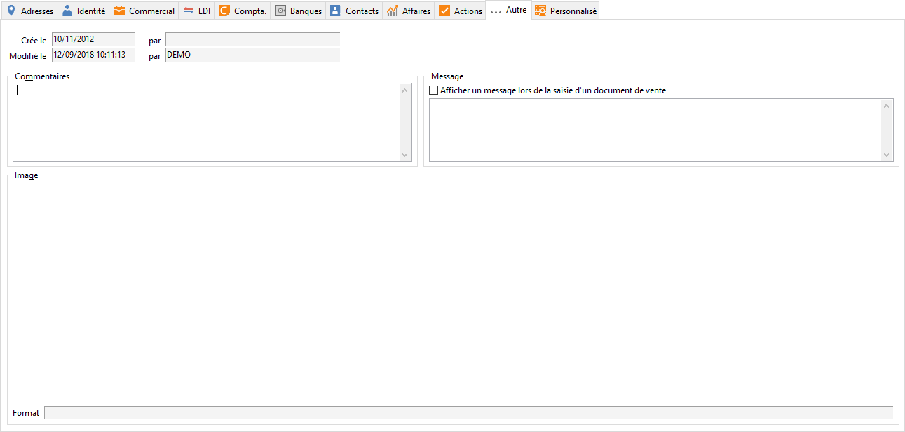

# Infos

## Dates

La date de création de la fiche du tiers est fixe tandis que la date 
 de modification change automatiquement.

## Image

Un clic droit sur cette zone permet d’insérer, supprimer ou modifier 
 une image au format : JPG, JPEG, GIF, EMF, WMF, BMP.

## Commentaires

Une zone d’environ 36 lignes est disponible pour saisir des informations 
 complémentaires sur le client.

