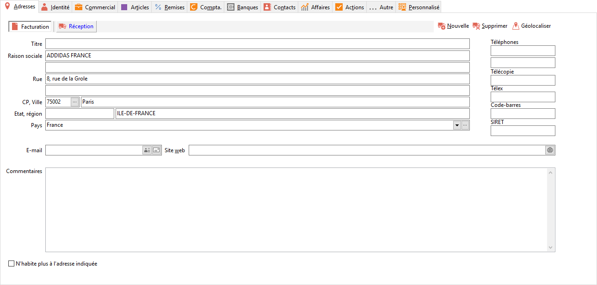

# Fournisseur

Chaque fiche fournisseur est composée d'une [entête](FournisseurEntete.md) 
 et des onglets suivants : [Adresses](FournisseurOngletAdresses.md), 
 [Identité](FournisseurOngletIdentité.md), [Commercial](FournisseurOngletCommercial.md), 
 [Articles](FournisseurOngletArticles.md), [Remises](FournisseurOngletRemises.md), 
 [Compta](FournisseurOngletCompta.md), [Banques](../../2/Prospect/ProspectOngletBanques.md), 
 [Contacts](../../2/Prospect/ProspectOngletContacts.md), [Affaires](../../2/Prospect/ProspectOngletAffaires.md), [Actions](../../2/Prospect/ProspectOngletActions.md), [Autre](../../2/Prospect/ProspectOngletInfos.md) et Personnalisé.

 

