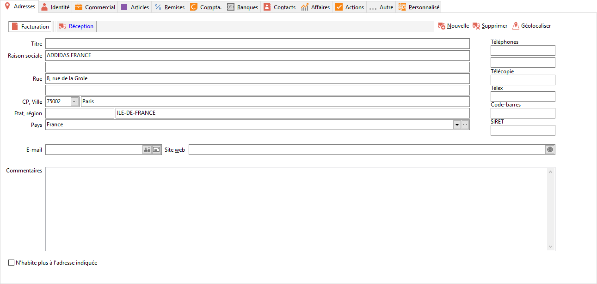
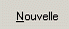

# Adresses

La raison sociale de l’adresse de facturation est automatiquement renseignée 
 par la raison sociale de la fiche fournisseur.

 

 

Les coordonnées à saisir du fournisseur sont la rue, le complément de 
 rue, le code postal, la ville, le pays et éventuellement l’état et la 
 région. Les recherches sur le fournisseur seront plus aisées si vous précisez 
 toutes les coordonnées de celui-ci.

 

La saisie du champ titre (20 caractères) permet de créer un onglet supplémentaire 
 dans la barre des adresses ainsi l’accès aux adresses de réception supplémentaires 
 sera plus rapide.

 

Lors de la saisie du pays, un message de confirmation vous demande si 
 vous souhaitez que la fiche fournisseur hérite des informations de la 
 fiche pays (devise, natures comptables…). Quelque soit votre réponse, 
 vous devez vérifier principalement la devise et la nature comptable du 
 tiers ([onglet Compta](FournisseurOngletCompta.md)).

 

Lorsque l’adresse du fournisseur est erronée, vous avez la possibilité 
 de sélectionner la case NPAI (N’habite Pas à l’Adresse Indiquée), ainsi 
 vous pourrez éditer la liste des tiers ayant une adresse inexacte.

Il est possible d’ajouter, à l’adresse de facturation et de réception, 
 d’autres adresses de réception (bouton ).

 

Ces adresses pourront être appelées en réalisation de documents à partir 
 de [l'onglet 
 Entête](../../../Achats/Documents/Fiche/2Adresses/OngletAdresses.md).

