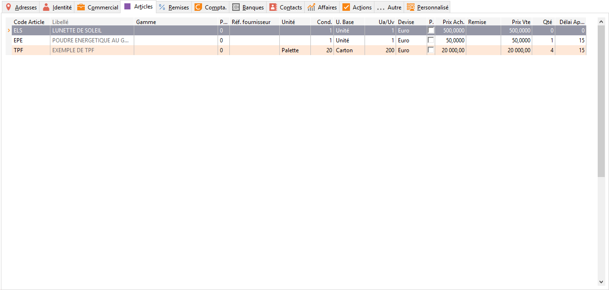

# Articles

Cet onglet fonctionne de la même façon que l'[onglet 
 Fournisseurs des articles](../../../Articles/1/Article/OngletFournisseurs/ArticleOngletFournisseurs.md).

 

 

Il permet d’enregistrer les articles référencés chez le fournisseur. 
 Si aucun article n’est associé au fournisseur, le logiciel appliquera 
 le [prix 
 d'achat général](../../../Articles/1/Article/OngletGeneral/ArticleOngletGeneral.md) de la fiche article (onglet Général).

 

Pour chaque article de la fiche fournisseurs, il est possible de préciser 
 :

* Une priorité 
 : par défaut celle de la fiche fournisseur (onglet admin);
* La référence 
 de l’article chez le fournisseur;
* La quantité 
 minimum (en unité d’achat);
* Le prix 
 d’achat : prix que le fournisseur vend l’article à la société 
 (Prix remisé que nous accorde le fournisseur);
* Un code 
 remise: la liste des remises est à définir dans la fiche du 
 fournisseur;
* Le prix 
 public : prix que le fournisseur vend l’article (prix catalogue);
* Le délai 
 d’approvisionnement;
* L’élément de la gamme de l’article 
 (uniquement pour les articles gérant les gammes);

 

D’autres champs 
 sont disponibles et paramétrables à partir des propriétés de la grille.

 

Vous avez la possibilité de créer (F4+Ins) 
 ou de modifier (F4+F2) les [fiches articles](../../../Articles/1/Article/Article.md) 
 directement depuis cet onglet.

 

Ces informations seront automatiquement prises en compte lors de la 
 génération manuelle ou automatique des commandes fournisseurs.

 

En facturation, le prix d’achat d’un article est réajusté en fonction 
 de [la remise](FournisseurOngletCommercial.md) et/ou de la 
 [grille de tarifs](FournisseurOngletCommercial.md) associées 
 à la fiche fournisseur.

 

Le menu contextuel (clic droit) de cette grille vous permet :

* D'insérer 
 un article,
* De supprimer 
 un article,
* D’importer 
 les tarifs du fournisseur pour l’article de la ligne sélectionnée 
 et ceux présents dans la liste,
* D’imprimer 
 suivant un modèle précis,
* De rafraîchir 
 la grille de saisie,
* D'accéder 
 à toutes les fonctions générales d'une grille.

