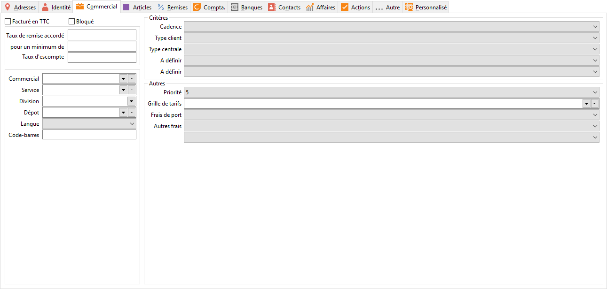

# Commercial

## Facture en ttc

Cette option sera initialisée à la création de la fiche Tiers avec l’option 
 paramétré dans les Préférences de gestion/ventes ou achat/HT.

 

Elle sera reprise dans les documents lors de la sélection du tiers.

## Bloque

Cette option permet de bloquer la saisi de tout document pour ce tiers.

 

Si le tiers a un tiers payeur associé, le contrôle 
 se fera sur le payeur.

 

Le contrôle est effectué également lors d'un 
 transfert de document.

## Remise sur facture

### Remise

La remise sera automatiquement appliquée en [pied 
 de document.](../../../Achats/Documents/Fiche/4Pied/OngletPied.md)

 

Si vous renseignez en plus le "pour 
 un minimum de", la remise sera accordée si le montant HT est 
 supérieur au montant minimum saisi.

### Escompte

Pour saisir un taux d’escompte, il faut obligatoirement en avoir renseigné 
 un dans les préférences de la société. Ce taux ne peut-être supérieur 
 à celui des préférences.

 

L’escompte sera automatiquement appliqué en [pied 
 de document](../../../Achats/Documents/Fiche/4Pied/OngletPied.md)

 

Ils peuvent être définis au niveau de la [famille 
 ou sous-famille de tiers](../../7/ListeFamillesTiers.md).

### Affectations

### Service - Division

Service et division peuvent être définis au niveau de la [famille 
 ou sous-famille de tiers](../../7/ListeFamillesTiers.md).

### Dépôt

Le dépôt sera par défaut repris en création d’un document au lieu du 
 dépôt principal (défini dans les préférences du dossier).

### Langue

La langue du pays de facturation du fournisseur est automatiquement 
 proposée mais il est possible d’indiquer une autre langue. Elle sera automatiquement 
 reprise en réalisation d’un document (onglet Entête) et sert pour imprimer 
 des modèles de document particulier.

## Critères spécifiques

Les cinq critères supplémentaires sont à définir dans les tables (Critères 
 sur tiers) de la société. Ce sont des informations complémentaires sur 
 les tiers mis à votre disposition pour répondre à des caractéristiques 
 tiers propres à votre activité commerciale.

## Autres

### Priorité

La priorité sert à la [génération 
 des commandes fournisseurs](../../../Achats/Reapprovisionnement/2/Commander.md). Elle peut être définie au niveau de la 
 [famille ou sous-famille de tiers](../../7/ListeFamillesTiers.md).

### Grille de tarif

La grille de tarif permet d’appliquer une tarification particulière 
 pour ce fournisseur. La grille peut être définie au niveau de la [famille 
 ou sous-famille de tiers](../../7/ListeFamillesTiers.md).

### Port / Frais / Frais supplémentaire

Le port, les frais et les frais supplémentaires seront automatiquement 
 proposés en pied de document.

